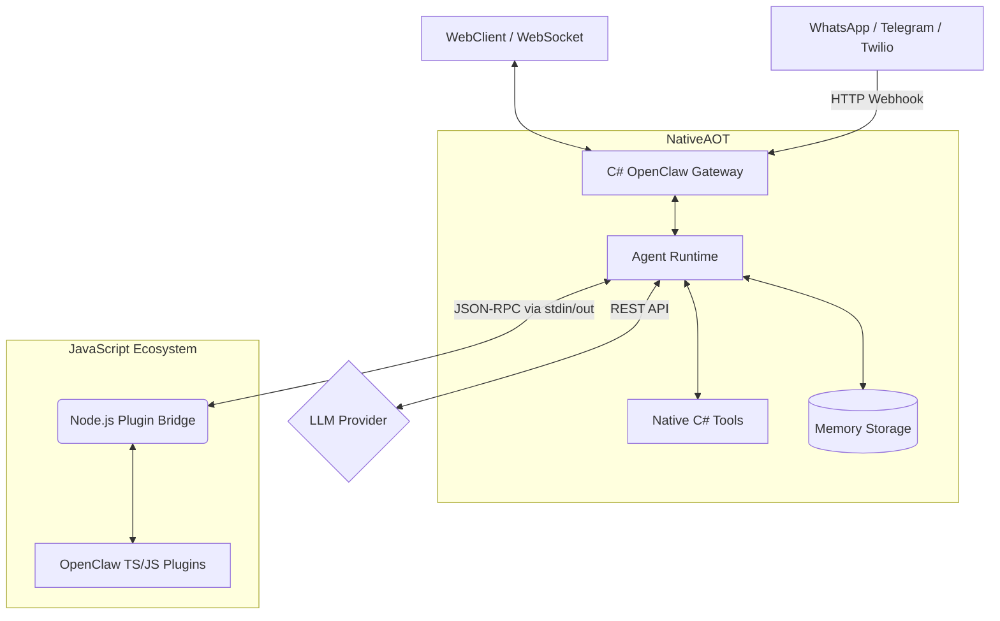

# OpenClaw.NET

[](https://github.com/Telli/openclaw.net/actions/workflows/ci.yml)
[](https://hub.docker.com/r/telli/openclaw-gateway)
[](https://opensource.org/licenses/MIT)

> **Disclaimer**: This project is not affiliated with, endorsed by, or associated with [OpenClaw](https://github.com/openclaw/openclaw). It is an independent .NET implementation inspired by their excellent work.

Self-hosted OpenClaw gateway + agent runtime in .NET (NativeAOT-friendly).

## Architecture

OpenClaw.NET uses a decoupled architecture to achieve NativeAOT performance while retaining full compatibility with the massive JavaScript plugin ecosystem.



## Why OpenClaw.NET? (Comparison)

| Feature | Original OpenClaw | OpenClaw.NET (This Project) |
| :--- | :--- | :--- |
| **Language** | Node.js / TypeScript | C# 13 / .NET 10 |
| **Runtime Size** | Large (Requires full Node/npm) | **~15MB** (Standalone NativeAOT binary) |
| **Idle Memory (RAM)**| ~150MB+ | **<50MB** |
| **Startup Time** | ~2-3 seconds | **Sub-second** (Instant) |
| **Ecosystem Support**| Native TS Plugins | **Full Native + Bridged TS Plugins** |
| **Orchestration** | Express/Koa based | ASP.NET Core Kestrel |

## Editions

- **Community Edition (this repo)**: fully open source (see `LICENSE`).
- **Enterprise Edition**: source-available add-ons in a separate repo/directory (`openclaw.net-enterprise`).

Typical local layout:
- `openclaw.net/` (Community)
- `openclaw.net-enterprise/` (Enterprise)

- [Tool Guide](TOOLS_GUIDE.md) — Detailed setup for all 18+ native tools.
- [User Guide](USER_GUIDE.md) — Core concepts and architecture.
- [Security Guide](SECURITY.md) — Mandatory reading for public deployments.

## Quickstart (local)

1. Set your API key:
   - `export MODEL_PROVIDER_KEY="..."`
   - *For advanced LLM provider setup (Ollama, Anthropic, Azure) see the [User Guide](USER_GUIDE.md).*
2. Run the gateway:
   - `dotnet run --project src/OpenClaw.Gateway -c Release`
3. Connect a WebSocket client:
   - `ws://127.0.0.1:18789/ws`

## Companion app (Avalonia)

Run the cross-platform desktop companion:
- `dotnet run --project src/OpenClaw.Companion -c Release`

Notes:
- For non-loopback binds, set `OPENCLAW_AUTH_TOKEN` on the gateway and enter the same token in the companion app.
- If you enable “Remember”, the token is saved to `settings.json` under your OS application data directory.

## WebSocket protocol

The gateway supports **both**:

### Raw text (legacy)
- Client sends: raw UTF-8 text
- Server replies: raw UTF-8 text

### JSON envelope (opt-in)
If the client sends JSON shaped like this, the gateway replies with JSON:

Client → Server:
```json
{ "type": "user_message", "text": "hello", "messageId": "optional", "replyToMessageId": "optional" }
```

Server → Client:
```json
{ "type": "assistant_message", "text": "hi", "inReplyToMessageId": "optional" }
```

## Internet-ready deployment

### Authentication (required for non-loopback bind)
If `OpenClaw:BindAddress` is not loopback (e.g. `0.0.0.0`), you **must** set `OpenClaw:AuthToken` / `OPENCLAW_AUTH_TOKEN`.

Preferred client auth:
- `Authorization: Bearer <token>`

Optional legacy auth (disabled by default):
- `?token=<token>` when `OpenClaw:Security:AllowQueryStringToken=true`

### TLS
You can run TLS either:
- Behind a reverse proxy (recommended): nginx / Caddy / Cloudflare, forwarding to `http://127.0.0.1:18789`
- Directly in Kestrel: configure HTTPS endpoints/certs via standard ASP.NET Core configuration

If you enable `OpenClaw:Security:TrustForwardedHeaders=true`, set `OpenClaw:Security:KnownProxies` to the IPs of your reverse proxies.

### Hardened public-bind defaults
When binding to a non-loopback address, the gateway **refuses to start** unless you explicitly harden (or opt in to) the most dangerous settings:
- Wildcard tooling roots (`AllowedReadRoots=["*"]`, `AllowedWriteRoots=["*"]`)
- `OpenClaw:Tooling:AllowShell=true`
- `OpenClaw:Plugins:Enabled=true` (JS plugin bridge)
- `raw:` secret refs (to reduce accidental secret commits)

To override (not recommended), set:
- `OpenClaw:Security:AllowUnsafeToolingOnPublicBind=true`
- `OpenClaw:Security:AllowPluginBridgeOnPublicBind=true`
- `OpenClaw:Security:AllowRawSecretRefsOnPublicBind=true`

### Tooling warning
This project includes local tools (`shell`, `read_file`, `write_file`). If you expose the gateway publicly, strongly consider restricting:
- `OpenClaw:Tooling:AllowShell=false`
- `OpenClaw:Tooling:AllowedReadRoots` / `AllowedWriteRoots` to specific directories

## Plugin Ecosystem Compatibility 🔌

OpenClaw.NET natively supports the original [OpenClaw TypeScript/JavaScript plugin ecosystem](https://github.com/openclaw/openclaw). You don't need to learn C# to extend your agent!

When you enable `OpenClaw:Plugins:Enabled=true`, the Gateway spawns a highly-optimized Node.js JSON-RPC bridge.
Simply drop any standard OpenClaw `.ts` or `.js` plugin into your `.openclaw/extensions` folder (or configure `Plugins:Load:Paths`), and the .NET runtime will expose those tools to the AI seamlessly.

For full details, feature matrices, and TypeScript requirements (like `jiti`), please see the **[Plugin Compatibility Guide](COMPATIBILITY.md)**.

## Telegram Webhook channel

### Setup
1. Create a Telegram Bot via BotFather and obtain the Bot Token.
2. Set the auth token as an environment variable:
   - `export OPENCLAW_BOT_TOKEN="..."`
3. Configure `OpenClaw:Channels:Telegram` in `src/OpenClaw.Gateway/appsettings.json`:
   - `Enabled=true`
   - `BotTokenRef="env:OPENCLAW_BOT_TOKEN"`

### Webhook
Register your public webhook URL directly with Telegram's API:
- `POST https://api.telegram.org/bot<vour-bot-token>/setWebhook?url=https://<your-public-host>/.openclaw/telegram/webhook`

## Twilio SMS channel

### Setup
1. Create a Twilio Messaging Service (recommended) or buy a Twilio phone number.
2. Set the auth token as an environment variable:
   - `export TWILIO_AUTH_TOKEN="..."`
3. Configure `OpenClaw:Channels:Sms:Twilio` in `src/OpenClaw.Gateway/appsettings.json`:
   - `Enabled=true`
   - `AccountSid=...`
   - `AuthTokenRef="env:TWILIO_AUTH_TOKEN"`
   - `MessagingServiceSid=...` (preferred) or `FromNumber="+1..."` (fallback)
   - `AllowedFromNumbers=[ "+1YOUR_MOBILE" ]`
   - `AllowedToNumbers=[ "+1YOUR_TWILIO_NUMBER" ]`
   - `WebhookPublicBaseUrl="https://<your-public-host>"` (required when `ValidateSignature=true`)

### Webhook
Point Twilio’s inbound SMS webhook to:
- `POST https://<your-public-host>/twilio/sms/inbound`

Recommended exposure options:
- Reverse proxy with TLS
- Cloudflare Tunnel
- Tailscale funnel / reverse proxy

### Security checklist
- Keep `ValidateSignature=true`
- Use strict allowlists (`AllowedFromNumbers`, `AllowedToNumbers`)
- Do not set `AuthTokenRef` to `raw:...` outside local development

## Docker deployment

### Quick start
1. Set required environment variables:

**Bash / Zsh:**
```bash
export MODEL_PROVIDER_KEY="sk-..."
export OPENCLAW_AUTH_TOKEN="$(openssl rand -hex 32)"
```

**PowerShell:**
```powershell
$env:MODEL_PROVIDER_KEY = "sk-..."
$env:OPENCLAW_AUTH_TOKEN = [Convert]::ToHexString((1..32 | Array { Get-Random -Min 0 -Max 256 }))
$env:EMAIL_PASSWORD = "..." # (Optional) For email tool
```

> **Note**: For the built-in WebChat UI (`http://<ip>:18789/chat`), enter this exact `OPENCLAW_AUTH_TOKEN` value in the "Auth Token" field at the top of the interface. If you enable the **Email Tool**, make sure to set `EMAIL_PASSWORD` similarly.

# 2. Run (gateway only)
docker compose up -d openclaw

# 3. Run with automatic TLS via Caddy
export OPENCLAW_DOMAIN="openclaw.example.com"
docker compose --profile with-tls up -d
```

### Build from source
```bash
docker build -t openclaw-gateway .
docker run -d -p 18789:18789 \
  -e MODEL_PROVIDER_KEY="sk-..." \
  -e OPENCLAW_AUTH_TOKEN="change-me" \
  -v openclaw-memory:/app/memory \
  openclaw-gateway
```

The Dockerfile uses a multi-stage build:
1. **Build stage** — full .NET SDK, runs tests, publishes NativeAOT binary
2. **Runtime stage** — Ubuntu Chiseled (distroless), ~15 MB, non-root user

### Volumes
| Path | Purpose |
|------|---------|
| `/app/memory` | Session history + memory notes (persist across restarts) |
| `/app/workspace` | Mounted workspace for file tools (optional) |

## Production hardening checklist

- [ ] Set `OPENCLAW_AUTH_TOKEN` to a strong random value
- [ ] Set `MODEL_PROVIDER_KEY` via environment variable (never in config files)
- [ ] Use `appsettings.Production.json` (`AllowShell=false`, restricted roots)
- [ ] Enable TLS (reverse proxy or Kestrel HTTPS)
- [ ] Set `AllowedOrigins` if serving a web frontend
- [ ] Set `TrustForwardedHeaders=true` + `KnownProxies` if behind a proxy
- [ ] Set `MaxConnectionsPerIp` and `MessagesPerMinutePerConnection` for rate limiting
- [ ] Monitor `/health` and `/metrics` endpoints
- [ ] Pin a specific Docker image tag (not `:latest`) in production

## TLS options

### Option 1: Caddy reverse proxy (recommended)
The included `docker-compose.yml` has a Caddy service with automatic HTTPS:
```bash
export OPENCLAW_DOMAIN="openclaw.example.com"
docker compose --profile with-tls up -d
```
Caddy auto-provisions Let's Encrypt certificates. Edit `deploy/Caddyfile` to customize.

### Option 2: nginx reverse proxy
```nginx
server {
    listen 443 ssl http2;
    server_name openclaw.example.com;

    ssl_certificate     /etc/letsencrypt/live/openclaw.example.com/fullchain.pem;
    ssl_certificate_key /etc/letsencrypt/live/openclaw.example.com/privkey.pem;

    location / {
        proxy_pass http://127.0.0.1:18789;
        proxy_http_version 1.1;
        proxy_set_header Upgrade $http_upgrade;
        proxy_set_header Connection "upgrade";
        proxy_set_header Host $host;
        proxy_set_header X-Forwarded-For $proxy_add_x_forwarded_for;
        proxy_set_header X-Forwarded-Proto $scheme;
    }
}
```

### Option 3: Kestrel HTTPS (no reverse proxy)
Configure directly in `appsettings.json`:
```json
{
  "Kestrel": {
    "Endpoints": {
      "Https": {
        "Url": "https://0.0.0.0:443",
        "Certificate": {
          "Path": "/certs/cert.pfx",
          "Password": "env:CERT_PASSWORD"
        }
      }
    }
  }
}
```

### Observability & Distributed Tracing

OpenClaw natively integrates with **OpenTelemetry**, providing deep insights into agent reasoning, tool execution, and session lifecycles.

| Endpoint | Auth | Description |
|----------|------|-------------|
| `GET /health` | Token (if non-loopback) | Basic health check (`{ status, uptime }`) |
| `GET /metrics` | Token (if non-loopback) | Runtime counters (requests, tokens, tool calls, circuit breaker state) |

### Structured logging
All agent operations emit structured logs and `.NET Activity` traces with correlation IDs. You can export these to OTLP collectors like Jaeger, Prometheus, or Grafana:
```
[abc123def456] Turn start session=ws:user1 channel=websocket
[abc123def456] Tool browser completed in 1250ms ok=True
[abc123def456] Turn complete: Turn[abc123def456] session=ws:user1 llm=2 retries=0 tokens=150in/80out tools=1
```

Set log levels in config:
```json
{
  "Logging": {
    "LogLevel": {
      "Default": "Information",
      "AgentRuntime": "Debug",
      "SessionManager": "Information"
    }
  }
}
```

## CI/CD

GitHub Actions workflow (`.github/workflows/ci.yml`):
- **On push/PR to main**: build + test
- **On push to main**: publish NativeAOT binary artifact + Docker image to GitHub Container Registry
