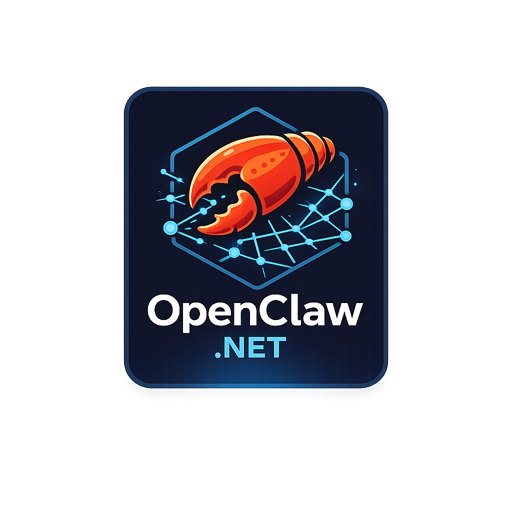
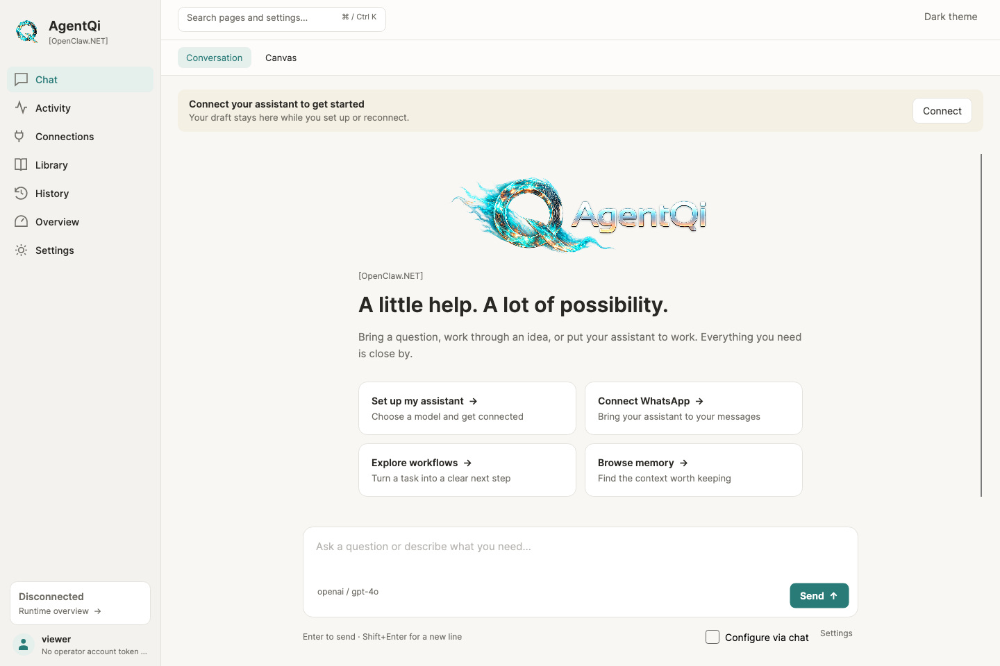

<div align="center">
  
</div>

# OpenClaw.NET

**A self-hosted AI agent runtime for .NET, with a desktop companion for everyday use.**

[](https://github.com/clawdotnet/openclaw.net/actions/workflows/ci.yml)
[](LICENSE)

[](https://deepwiki.com/clawdotnet/openclaw.net)

[Download desktop](#download-and-run-desktop) · [Run from source](#quickstart) · [Documentation](https://agentqi.dev) · [Compatibility](docs/COMPATIBILITY.md) · [中文](README-cn.md)

Run an assistant locally or host a gateway for your team. Connect a hosted or local model, give it tools and memory, and work through desktop chat, the browser, messaging channels, or APIs. Developers can extend the runtime in .NET and deploy supported capabilities with NativeAOT.

**OpenClaw.NET** is the runtime and repository. **AgentQi Companion** is the Avalonia desktop product for OpenClaw.NET; [AgentQi.dev](https://agentqi.dev) is the documentation and ecosystem home.

This is an independent .NET implementation inspired by [OpenClaw](https://github.com/openclaw/openclaw), with practical ecosystem compatibility. It is not affiliated with or endorsed by the upstream project.

## Meet the desktop companion

Chat is the starting point. AgentQi Companion brings setup, connections, activity, memory, history, and settings into one desktop interface, with light and dark themes.

<picture>
  <source media="(prefers-color-scheme: dark)" srcset="docs/images/companion/agentqi-dark.png" />
  <source media="(prefers-color-scheme: light)" srcset="docs/images/companion/agentqi-light.png" />
  
</picture>

*Companion welcome screen from `main`, before connecting a gateway. Packaged releases may show an earlier interface.*

- **Set up through the app:** choose a provider and model, enter credentials in dedicated fields, and start a local gateway.
- **Describe a settings change:** use `/configure set the session timeout to 45 minutes`, review the proposed values, then apply or cancel.
- **Use the GUI when you prefer:** the manual settings editor works without a language model when the gateway is reachable; advanced setup is available when needed.

Chat configuration covers supported scalar settings, not every operation. Credentials, provider setup, and complex account objects retain dedicated forms. See [what can be configured through chat](docs/companion-chat-configuration.md).

## Download And Run Desktop

Choose a desktop bundle from the [latest release](https://github.com/clawdotnet/openclaw.net/releases/latest). Each includes AgentQi Companion, the NativeAOT gateway, and the NativeAOT CLI.

| Platform | Download |
| --- | --- |
| Windows x64 | [openclaw-desktop-win-x64.zip](https://github.com/clawdotnet/openclaw.net/releases/latest/download/openclaw-desktop-win-x64.zip) |
| Apple Silicon macOS | [openclaw-desktop-osx-arm64.zip](https://github.com/clawdotnet/openclaw.net/releases/latest/download/openclaw-desktop-osx-arm64.zip) |
| Linux x64 | [openclaw-desktop-linux-x64.zip](https://github.com/clawdotnet/openclaw.net/releases/latest/download/openclaw-desktop-linux-x64.zip) |

1. Extract the archive and launch Companion from the `companion` folder.
2. Open **Setup**. In the redesigned Companion, you can also choose **Set up my assistant** in Chat.
3. Choose your provider and model. Enter a hosted provider key, or choose Ollama for a local model server.
4. Click **Set Up and Start**.

Companion writes a local configuration, starts the bundled gateway on `127.0.0.1`, and connects to it. Embedded local inference is also available; see the [local model guide](docs/LOCAL_MODELS.md) for package installation and requirements.

The Windows and macOS release archives are currently unsigned. See the [release guide](docs/RELEASES.md) for first-run OS warnings, checksums, standalone CLI/gateway downloads, and signing status. The screenshot above shows development on `main`; check release notes for the features included in your download.

## Quickstart

### Run a local gateway from source

Install **Git and the .NET 10 SDK**, then clone the repository:

```bash
git clone https://github.com/clawdotnet/openclaw.net
cd openclaw.net
```

For the default hosted-provider path, set your API key and start the guided setup. These commands use Bash or zsh:

```bash
export MODEL_PROVIDER_KEY="sk-..."
dotnet run --project src/OpenClaw.Cli -c Release -- start
```

In PowerShell, set the key with `$env:MODEL_PROVIDER_KEY = "sk-..."`, then run the same `dotnet` command. To use another provider or a local model, follow the [provider setup guide](docs/QUICKSTART.md).

The CLI runs setup if needed, saves the local configuration, and launches the gateway. Wait for **`OpenClaw gateway ready.`**, then open:

| Surface | Address |
| --- | --- |
| Browser chat | `http://127.0.0.1:18789/chat` |
| Administration | `http://127.0.0.1:18789/admin` |
| Integration status API | `http://127.0.0.1:18789/api/integration/status` |
| MCP endpoint | `http://127.0.0.1:18789/mcp` |

Use named operator accounts for browser administration and operator account tokens for Companion, CLI, API, and WebSocket clients. The [quickstart](docs/QUICKSTART.md) covers the full first-run walkthrough and troubleshooting.

To try the Avalonia Companion from the same checkout:

```bash
dotnet run --project src/OpenClaw.Companion -c Release
```

Connect it to your running gateway through **Setup & runtime**. See [Companion token storage](docs/companion-token-storage.md) for authentication and credential handling.

### Try the runtime without an API key

From the repository root, this deterministic sample demonstrates the runtime loop and tool invocation without a model server, Docker, or a browser:

```bash
dotnet restore OpenClaw.Net.slnx
dotnet build OpenClaw.Net.slnx --configuration Release --no-restore
dotnet run --project samples/OpenClaw.HelloAgent -c Release --no-build
```

Expected output:

```text
OpenClaw.HelloAgent
User: hello
Agent: hello from OpenClaw.NET
Tool: echo(hello): ok
```

## What Works Now

| Area | Capabilities |
| --- | --- |
| Agent runtime | Streaming, tool execution, cancellation, retries, sessions, memory, and token-usage reporting. |
| Interfaces | AgentQi Companion, browser chat and admin UI, CLI, terminal UI, OpenAI-compatible HTTP endpoints, MCP, and WebSockets. |
| Models | OpenAI, Claude, Gemini, Azure OpenAI, DeepSeek, Ollama, and OpenAI-compatible providers; named profiles and optional embedded local inference. |
| Tools and channels | 80+ native and optional tool surfaces for files, web, sessions, databases, email, home automation, and more; adapters for Telegram, WhatsApp, Teams, Slack, Discord, and other channels. The active set depends on configuration. |
| Extensions | MCP servers and interactive MCP Apps, reusable `SKILL.md` packages, first-party .NET integrations, and supported OpenClaw TS/JS plugins. |
| Long-running work | Session-scoped `/goal` continuation, `/loop` recurring prompts, and optional durable workflow backends. |
| Review and observability | Tool approvals, diagnostics, audit and trajectory exports, passive harness contracts, evidence bundles, and optional Plan-Execute-Verify execution. |
| Developer tooling | Offline harness regression checks, static codebase maps, SkillKit authoring and validation, and TokenJuice tool-output reduction. |

Explore the [user guide](docs/USER_GUIDE.md), [tool catalog](docs/TOOLS_GUIDE.md), [SkillKit](docs/SKILLKIT.md), and [harness testing](docs/HARNESS_REGRESSION.md) for details. The separate [AgentQi Mobile repository](https://github.com/agentqi/agentqi-mobile) provides an Android operator console and build instructions.

## Compatibility and capability boundaries

NativeAOT support and upstream compatibility depend on the feature you enable. Check the [capability matrix](docs/CAPABILITY_MATRIX.md) and [compatibility guide](docs/COMPATIBILITY.md) before choosing a deployment lane.

| Lane | Examples |
| --- | --- |
| Core | Runtime loop, gateway, CLI, OpenAI-compatible API, and NativeAOT-friendly host path. |
| Optional | Companion, channel adapters, browser/MQTT packages, model integrations, and workflow backends. |
| Experimental | Embedded local model sidecars and adapter-oriented package paths. |
| JIT-only | Dynamically loaded native .NET plugins. |

For framework and agent interoperability, see [Microsoft Agent Framework](docs/integrations/microsoft-agent-framework.md), [A2A](docs/a2a.md), and [workflow backends](docs/workflow-backends.md). For interactive MCP App hosting, use the documented [gateway host routes](docs/MCPAPP.md).

## Security

Local setup binds the gateway to loopback. Before exposing it beyond your machine, read [SECURITY.md](SECURITY.md): the gateway refuses unsafe public-bind configurations until required authentication and tooling restrictions are in place.

Outbound web fetches and browser navigations use URL safety checks by default, including restrictions on private, loopback, link-local, and metadata destinations. See the security guide before changing those policies.

For private access while keeping the gateway on `127.0.0.1`, use [Tailscale Serve](docs/deployment/TAILSCALE.md):

```bash
openclaw setup tailscale serve
```

This command assumes the CLI is on your `PATH`; from a checkout, use `dotnet run --project src/OpenClaw.Cli -c Release -- setup tailscale serve`.

## Docs

Browse [AgentQi.dev](https://agentqi.dev) or the [complete repository documentation index](docs/README.md).

| Start here | What you will find |
| --- | --- |
| [Evaluator overview](docs/START_HERE.md) | What the project does and how to evaluate it. |
| [Quickstart](docs/QUICKSTART.md) | First-run setup, provider examples, diagnostics, and recovery. |
| [Getting started](docs/GETTING_STARTED.md) | Repository map, architecture, and contributor setup. |
| [User guide](docs/USER_GUIDE.md) | Providers, tools, skills, memory, channels, and daily operation. |
| [Companion chat configuration](docs/companion-chat-configuration.md) | Supported settings, review/apply behavior, and advanced setup. |
| [Releases](docs/RELEASES.md) | Downloads, checksums, signing status, and release procedures. |
| [Capability matrix](docs/CAPABILITY_MATRIX.md) | Core, optional, experimental, and JIT-only features. |
| [Local models](docs/LOCAL_MODELS.md) | Embedded model packages, sidecars, and frame-based video support. |
| [Architecture boundaries](docs/ARCHITECTURE_BOUNDARIES.md) | Runtime, gateway, extension, and AOT/JIT boundaries. |
| [Roadmap](docs/ROADMAP.md) | Planned work and current priorities. |
| [中文文档](docs/zh-CN/START_HERE.md) | Simplified Chinese first-run orientation. |

## Contributing

Contributions are welcome, especially security reviews, NativeAOT improvements, channel adapters, and performance benchmarks. Start with [CONTRIBUTING.md](CONTRIBUTING.md).

See [project governance](docs/project/governance.md), [maintainer roles](docs/project/maintainers.md), and the [review checklist](docs/maintainers/review-checklist.md) for contribution and review expectations.

## License

[MIT](LICENSE)
