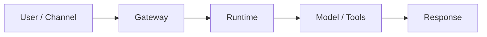
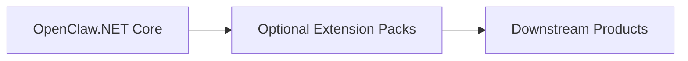

# Architecture Boundaries

OpenClaw.NET is a NativeAOT-friendly agent runtime and gateway for local and self-hosted .NET agent workloads. This page defines the intended project boundaries so contributors can decide what belongs in core, what belongs in the gateway, and what should stay in optional extension packs or downstream products.

## Project And Product Identity

| Name | Current role | Decision boundary |
| --- | --- | --- |
| **OpenClaw.NET** | Repository and runtime identity | Owns runtime correctness, local/self-hosted execution, gateway and CLI primitives, durable state, recovery, replay, and plugin execution compatibility. |
| **AgentQi** | Documentation and ecosystem umbrella | Owns the broader developer/operator experience, ecosystem discovery, trust and lifecycle UX, and future multi-instance or fleet-level management. |
| **AgentQi Companion** | Desktop product for OpenClaw.NET | Owns the chat-first desktop experience for setup and operation of one OpenClaw.NET runtime. “For OpenClaw.NET” describes the relationship; it is not a package, protocol, or storage rename. |
| **AgentQiX** | Reserved likely future runtime identity | No current package, repository, or runtime rename is implied. A migration requires an explicit naming decision, compatibility plan, and release boundary. |

The current rule is therefore to keep runtime capabilities in OpenClaw.NET, use AgentQi Companion for the desktop application, and describe cross-runtime ecosystem or managed-product work under AgentQi. Do not introduce AgentQiX naming into runtime packages or user-facing migration guidance until that separate decision is made.

### Naming surfaces

| Surface | Canonical label |
| --- | --- |
| Repository, runtime, gateway, CLI, packages, protocols, settings, and GitHub release titles | **OpenClaw.NET** |
| Desktop window chrome, application metadata, desktop-bundle descriptions, and desktop documentation | **AgentQi Companion**; use **AgentQi Companion for OpenClaw.NET** when the relationship needs explanation |
| Documentation and ecosystem navigation | **AgentQi** and **AgentQi.dev** |
| Future runtime references | Keep **AgentQiX** reserved until an explicit migration decision and compatibility plan exist |

## OpenClaw.NET Core

Core owns the stable runtime contracts and minimal behavior required to run agent workloads safely.

Core includes:

- agent runtime contracts and loop behavior
- session and memory abstractions
- tool execution contracts
- runtime hooks
- safety and diagnostics primitives
- source-generated serialization paths
- NativeAOT-friendly runtime behavior

Core should stay small, reusable, and compatible with the strict AOT lane.

## Gateway

The gateway is the local or self-hosted host around the runtime.

Gateway responsibilities include:

- local/self-hosted process hosting
- HTTP surfaces
- OpenAI-compatible endpoints
- MCP endpoints
- websocket surfaces
- admin, health, and diagnostics routes
- configuration, startup, and public-bind posture checks
- local backup, restore, reconciliation, and guided-recovery entry points

The gateway can compose optional surfaces, but it should not hide unsupported runtime modes or silently load extensions that require a different compatibility lane.

## Optional Extension Surfaces

Optional surfaces should be explicit, documented, and isolated from the core path when they add provider, adapter, plugin, or deployment-specific weight.

Examples include:

- browser automation through `OpenClaw.Protocols.Browser`
- protocol-specific packages such as MQTT through `OpenClaw.Protocols.Mqtt`
- plugin bridge
- channel adapters
- model providers
- memory providers
- workflow backends
- payment plugins
- industrial adapters

Extensions should fail fast when unsupported in the active runtime mode.

## Runtime Versus Ecosystem Operations

OpenClaw.NET owns the primitives required to operate one local or self-hosted runtime safely. This includes persisted dispatch state, deterministic replay inputs, instance backup and restore, recovery authorization, runtime diagnostics, and execution of compatible plugins.

AgentQi is the appropriate layer for experiences that coordinate or curate those primitives across projects or instances, such as fleet views, ecosystem catalogs, installation/update UX, trust review, collaboration, hosted control planes, and cross-instance policy. AgentQi may call OpenClaw.NET APIs, but core runtime correctness must not depend on an AgentQi service.

## Optional ONNX Boundaries

Dynamic turn routing is implemented in `OpenClaw.Routing.Onnx`, not `OpenClaw.Core`.

- `OpenClaw.Core` keeps only configuration and validation contracts.
- `OpenClaw.Agent` knows only the routing interface and turn-scoped decision model.
- `OpenClaw.Gateway` decides whether to compose the ONNX implementation.

This keeps ONNX and tokenizer dependencies out of the core runtime path and preserves the repository's NativeAOT-first boundary discipline.

## AOT/JIT Boundary

Core should remain AOT-friendly.

JIT, dynamic, or plugin-heavy surfaces should be explicit and optional. They should not add hidden reflection, dynamic loading, or provider SDK requirements to the default NativeAOT-friendly path.

Unsupported modes should fail fast with clear diagnostics rather than partially loading.

## What Belongs In Core

Core changes should focus on:

- stable abstractions
- runtime contracts
- security posture
- diagnostics
- minimal runtime behavior
- compatibility-safe primitives used by multiple surfaces

Core should not become a product-specific workflow engine or a vendor-specific integration bundle.

## What Should Not Enter Core

The following should stay out of core:

- company-specific product logic
- customer-specific workflows
- vendor-specific defaults
- heavy optional integrations without a clear boundary
- proprietary business rules
- closed commercial UX assumptions

These may belong in optional extension packs, separate adapters, examples, docs, or downstream products.

## Industrial Pack Boundary

Industrial Pack work should be reusable infrastructure, adapters, examples, templates, and docs.

Appropriate Industrial Pack work includes:

- reusable industrial abstractions
- protocol adapters
- simulated machine examples
- telemetry ingestion contracts
- alert classification samples
- maintenance-ticket samples
- shift-summary samples
- diagnostics and observability examples
- deployment guidance

Industrial Pack work should not include proprietary customer deployments, product-specific digital employee workflows, vendor-exclusive defaults, or closed commercial UX.

## Runtime Flow

## Extension And Product Layers

## Review Rule

When a change is hard to place, reviewers should ask:

- Does this need to be a stable runtime contract?
- Does this affect gateway safety, public-bind behavior, or operator diagnostics?
- Does this preserve NativeAOT compatibility?
- Does this belong in an optional extension instead of core?
- Is this reusable infrastructure or product-specific logic?
- Does this preserve vendor neutrality?
- Is this single-runtime correctness (OpenClaw.NET) or cross-runtime ecosystem/product UX (AgentQi)?
- Does the change accidentally imply an AgentQiX rename without an approved migration decision?
