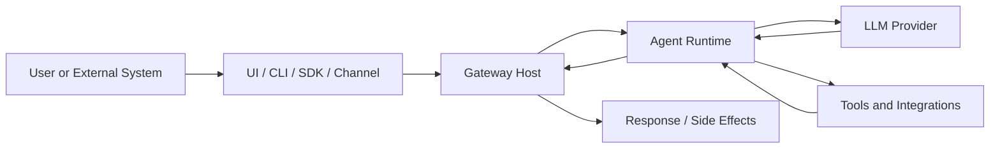
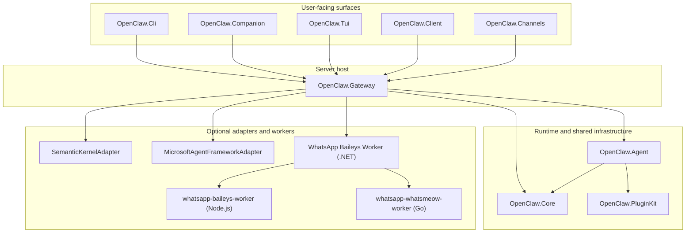
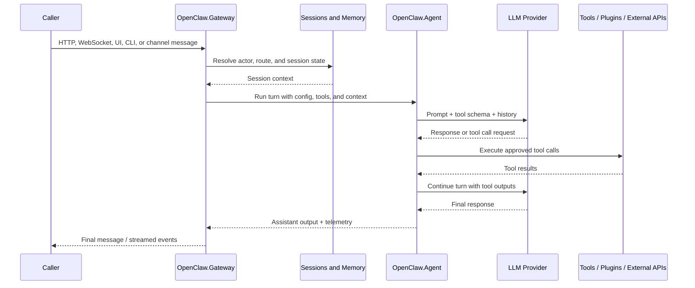
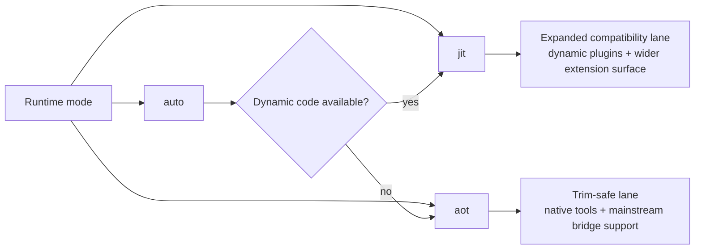

# Getting Started

This guide is for the "I cloned the repo, but I still do not know what the main pieces are" problem.

If you want the shortest path to a running instance, use [QUICKSTART.md](QUICKSTART.md). If you want the broader mental model first, read this page once, then run the quickstart.

## What OpenClaw.NET Is

OpenClaw.NET is a self-hosted .NET agent platform made of a few distinct layers:

1. A gateway process that exposes HTTP, WebSocket, web UI, admin UI, and webhook endpoints.
2. An agent runtime that runs the model loop, selects tools, and coordinates sessions, memory, approvals, and routing.
3. Tool backends and integrations that let the agent read files, run shell commands, search the web, talk to channels, and call external systems.
4. Optional client surfaces such as the CLI, desktop Companion, TUI, and typed .NET client.

The fastest way to stay oriented is to think of it like this:

`user/channel -> gateway -> session/runtime -> model -> tools/integrations -> response`



## Main Parts Of The Repository

These are the directories most people need first:

| Path | What it is |
| --- | --- |
| `src/OpenClaw.Gateway` | Main ASP.NET host. Starts the server, maps endpoints, serves `/chat`, `/admin`, `/mcp`, webhooks, diagnostics, and auth surfaces. |
| `src/OpenClaw.Core` | Shared models and infrastructure: config, memory, sessions, security, observability, plugin metadata, validation. |
| `src/OpenClaw.Agent` | Agent runtime, tool execution, plugin bridge, delegation, and the reasoning/tool loop. |
| `src/OpenClaw.Channels` | Channel adapters and channel-facing transport logic. |
| `src/OpenClaw.Cli` | `openclaw` command-line entrypoint: setup, launch, status, admin, models, plugins, skills, and one-shot/chat flows. |
| `src/OpenClaw.Companion` | Desktop companion app. Useful for local operator workflows. |
| `src/OpenClaw.Tui` | Terminal UI. |
| `src/OpenClaw.Client` | Typed .NET client for the integration API and MCP facade. |
| `src/OpenClaw.SemanticKernelAdapter` | Semantic Kernel integration layer. |
| `src/OpenClaw.MicrosoftAgentFrameworkAdapter` | Optional Microsoft Agent Framework adapter. |
| `src/OpenClaw.PluginKit` | Support code for plugin authoring and plugin integration. |
| `src/OpenClaw.Tests` | Unit and integration-style tests for the runtime and services. |
| `src/OpenClaw.WhatsApp.BaileysWorker` | .NET-facing WhatsApp worker integration project. |
| `src/whatsapp-baileys-worker` | Node.js worker used by the WhatsApp Baileys bridge. |
| `src/whatsapp-whatsmeow-worker` | Go worker for WhatsApp-related integration work. |

## How The Pieces Fit Together

### Repository mental model

This is the simplest way to understand the codebase boundaries:



### Runtime path

When a request comes in from the browser UI, CLI, WebSocket, or a channel:

1. `OpenClaw.Gateway` receives it and applies auth, policy, and routing.
2. Session and memory services from `OpenClaw.Core` load or create the session state.
3. `OpenClaw.Agent` runs the turn: prompt assembly, model call, tool calling, retries, delegation, approvals, and final response.
4. Tools execute against native implementations, plugin bridges, or external systems.
5. The gateway sends the response back to the caller and records telemetry.



### Startup mental model

At startup, the gateway is doing more than "run ASP.NET". It has a staged boot path:

```mermaid
flowchart LR
    Args["CLI args + config path"] --> Bootstrap["Bootstrap"]
    Bootstrap --> Config["Bind GatewayConfig + resolve secrets"]
    Config --> Checks["Early checks: health-check, doctor, hardening"]
    Checks --> Services["Composition: register services"]
    Services --> Build["builder.Build()"]
    Build --> Runtime["Initialize runtime"]
    Runtime --> Plugins["Load providers, skills, plugins, workers"]
    Plugins --> Pipeline["Apply middleware and pipeline"]
    Pipeline --> Endpoints["Map /chat, /admin, /mcp, webhooks, diagnostics"]
    Endpoints --> Run["Run gateway"]
```



### Why there are several executables

- Use `OpenClaw.Gateway` when you want the server itself.
- Use `OpenClaw.Cli` when you want setup, diagnostics, one-shot runs, chat, or local launch helpers.
- Use `OpenClaw.Companion` when you want the desktop operator experience.
- Use `OpenClaw.Tui` when you want a terminal interface instead of the browser or desktop app.

The CLI is the normal first entrypoint even if the gateway is your real target, because `openclaw setup` creates config and `openclaw setup launch` gives the easiest first run from source.

### Runtime modes mental model



## Prerequisites

- .NET 10 SDK
- Git
- Optional: Node.js 20+ if you want upstream-style TS/JS plugin support
- Optional: Docker if you want container deployment or isolated tool execution backends
- Optional: Go if you plan to work on the Go-based WhatsApp worker

## Recommended First Local Run

From a source checkout:

```bash
git clone https://github.com/clawdotnet/openclaw.net
cd openclaw.net

export MODEL_PROVIDER_KEY="sk-..."

dotnet restore
dotnet build
dotnet run --project src/OpenClaw.Cli -c Release -- setup
```

What `setup` gives you:

- an external config file, usually at `~/.openclaw/config/openclaw.settings.json`
- an adjacent env example
- the exact commands to launch the gateway
- follow-up diagnostics commands such as `--doctor` and `openclaw admin posture`

Then launch the supported local dev flow:

```bash
dotnet run --project src/OpenClaw.Cli -c Release -- setup launch --config ~/.openclaw/config/openclaw.settings.json
```

`setup launch` is the easiest place to start because it boots the gateway, starts Companion, waits for readiness, and streams logs until you stop it.

## What To Open After Startup

For a default local setup:

- Browser chat UI: `http://127.0.0.1:18789/chat`
- Admin UI: `http://127.0.0.1:18789/admin`
- MCP endpoint: `http://127.0.0.1:18789/mcp`
- Integration API status: `http://127.0.0.1:18789/api/integration/status`

If you prefer direct server startup instead of the launch helper, use the command printed by `setup`, typically:

```bash
dotnet run --project src/OpenClaw.Gateway -c Release -- --config ~/.openclaw/config/openclaw.settings.json
```

## Typical Setup Questions Answered

### Where does configuration live?

The supported path is an external JSON config generated by `openclaw setup`. You do not need to start by editing `src/OpenClaw.Gateway/appsettings.json`.

### When do I need `aot` vs `jit`?

- Use `aot` when you want the trim-safe, lower-complexity runtime lane.
- Use `jit` when you need the wider plugin compatibility surface, including dynamic plugin features.
- Use `auto` if you want the runtime to choose based on environment support.

If you are just trying to get the project running locally, do not optimize this early. Start with the generated defaults and switch only if you hit a plugin/runtime requirement.

### Do I need every subproject to work on the repo?

No. Most contributors only need:

- `OpenClaw.Gateway`
- `OpenClaw.Cli`
- `OpenClaw.Core`
- `OpenClaw.Agent`
- `OpenClaw.Tests`

The channel workers and optional adapters matter only when you are working in those areas.

## How To Debug A First-Run Problem

Start with the tools that already exist for onboarding diagnostics:

1. Run the generated doctor command:

```bash
dotnet run --project src/OpenClaw.Gateway -c Release -- --config ~/.openclaw/config/openclaw.settings.json --doctor
```

2. Check the security and deployment posture:

```bash
OPENCLAW_BASE_URL=http://127.0.0.1:18789 OPENCLAW_AUTH_TOKEN=... dotnet run --project src/OpenClaw.Cli -c Release -- admin posture
```

3. Summarize the config and artifact state:

```bash
dotnet run --project src/OpenClaw.Cli -c Release -- setup status --config ~/.openclaw/config/openclaw.settings.json
```

4. Open the browser UI and use the Doctor view or fetch `/doctor/text` when the gateway is already up.

When debugging, prefer `setup launch` over manually starting several processes. It gives one place to watch logs and confirm whether the gateway actually became ready.

### Common causes

| Symptom | Usually means |
| --- | --- |
| Gateway fails before first prompt | Config or secret problem, often missing API key or invalid provider/model settings. |
| Gateway starts but tools are missing | Tooling restrictions, plugin trust/runtime mode mismatch, or optional integrations not configured. |
| Public bind fails hardening checks | Missing `OPENCLAW_AUTH_TOKEN`, missing proxy/TLS-related settings, or an unsafe tool/plugin posture for a non-loopback bind. |
| Workspace/file tools behave unexpectedly | Workspace root or allowed read/write roots do not match the directory you expected. |
| Plugin works in one mode but not another | You likely need `jit`, or the plugin uses a surface that is intentionally unavailable in `aot`. |

## Recommended Reading Order

1. This guide
2. [QUICKSTART.md](QUICKSTART.md)
3. [USER_GUIDE.md](USER_GUIDE.md)
4. [TOOLS_GUIDE.md](TOOLS_GUIDE.md)
5. [COMPATIBILITY.md](COMPATIBILITY.md)
6. [SECURITY.md](../SECURITY.md) before any public deployment

## If You Are Contributing Code

Use [CONTRIBUTING.md](../CONTRIBUTING.md) for build, test, and PR expectations. The contributor guide now includes a current project map, but this page is still the better first stop when you need to understand the runtime shape before changing code.
