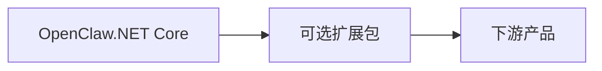

# 架构边界

OpenClaw.NET 是一个 NativeAOT 友好的 Agent 运行时和网关，面向本地和自托管的 .NET Agent 工作负载。本页定义了预期的项目边界，以便贡献者能够判断什么属于 core、什么属于网关、什么应保留在可选扩展包或下游产品中。

## OpenClaw.NET Core

Core 拥有稳定的运行时契约和安全运行 Agent 工作负载所需的最小行为集合。

Core 包含：

- Agent 运行时契约和循环行为
- 会话和记忆抽象
- 工具执行契约
- 运行时 hooks
- 安全和诊断基础组件
- 源生成的序列化路径
- NativeAOT 友好的运行时行为

Core 应保持小巧、可复用，并与严格的 AOT 通道兼容。

## 网关（Gateway）

网关是围绕运行时的本地或自托管宿主。

网关职责包括：

- 本地/自托管进程托管
- HTTP 接口
- OpenAI 兼容端点
- MCP 端点
- WebSocket 接口
- 管理、健康和诊断路由
- 配置、启动和公开绑定态势检查

网关可以组合可选接口，但不应隐藏不受支持的运行时模式，也不应静默加载需要不同兼容性通道的扩展。

## 可选扩展接口

可选接口应是明确的、有文档记录的，并且当它们增加 provider、适配器、插件或部署特定权重时，应与核心路径隔离。

示例包括：

- 通过 `OpenClaw.Protocols.Browser` 的浏览器自动化
- 通过 `OpenClaw.Protocols.Mqtt` 的协议特定包（如 MQTT）
- 插件桥接
- 通道适配器
- 模型 Provider
- 记忆 Provider
- 工作流后端
- 支付插件
- 工业适配器

扩展在当前运行时模式下不受支持时应快速失败。

## 可选 ONNX 边界

动态推理轮次路由在 `OpenClaw.Routing.Onnx` 中实现，而非 `OpenClaw.Core`。

- `OpenClaw.Core` 仅保留配置和验证契约。
- `OpenClaw.Agent` 仅了解路由接口和推理轮次作用域的决策模型。
- `OpenClaw.Gateway` 决定是否组合 ONNX 实现。

这使 ONNX 和分词器依赖保持在核心运行时路径之外，并维持仓库的 NativeAOT 优先边界纪律。

## AOT/JIT 边界

Core 应保持 AOT 友好。

JIT、动态或插件密集的接口应是明确且可选的。它们不应向默认的 NativeAOT 友好路径添加隐藏的反射、动态加载或 Provider SDK 依赖。

不受支持的模式应快速失败并输出清晰的诊断信息，而非部分加载。

## 什么属于 Core

Core 的变更应聚焦于：

- 稳定的抽象
- 运行时契约
- 安全态势
- 诊断
- 最小运行时行为
- 被多个接口使用的兼容安全的基础组件

Core 不应成为特定产品的工作流引擎或供应商特定的集成包。

## 什么不应进入 Core

以下内容应保持在 Core 之外：

- 公司特定的产品逻辑
- 客户特定的工作流
- 供应商特定的默认配置
- 没有明确边界的重量级可选集成
- 专有业务规则
- 闭源商业 UX 假设

这些可能属于可选扩展包、独立适配器、示例、文档或下游产品。

## 行业包边界

行业包工作应是可复用的基础设施、适配器、示例、模板和文档。

合适的行业包工作包括：

- 可复用的工业抽象
- 协议适配器
- 模拟机器示例
- 遥测采集契约
- 告警分类示例
- 维护工单示例
- 班次摘要示例
- 诊断和可观测性示例
- 部署指南

行业包工作不应包括专有客户部署、特定产品的数字员工工作流、供应商专属默认配置或闭源商业 UX。

## 运行时流程

## 扩展与产品层

## 审查规则

当变更难以归类时，审查者应提问：

- 这需要是一个稳定的运行时契约吗？
- 这会影响网关安全、公开绑定行为或运维者诊断吗？
- 这保持了 NativeAOT 兼容性吗？
- 这属于可选扩展而非 core 吗？
- 这是可复用的基础设施还是特定产品的逻辑？
- 这保持了供应商中立性吗？
