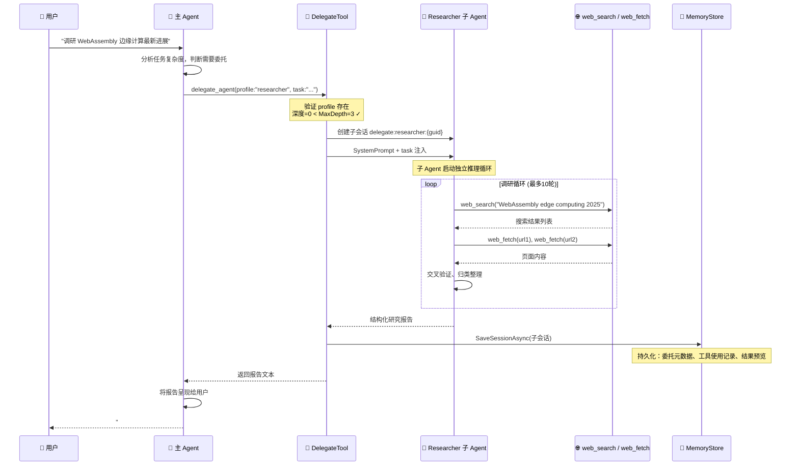
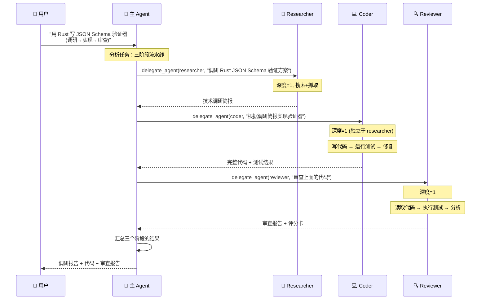

# delegate_agent 多 Agent 委托 — 实战教程

本教程以两个典型场景为线索，手把手教你配置和使用 OpenClaw.NET 的 `delegate_agent` 多 Agent 委托工具。

> **前置条件**：已部署 OpenClaw.NET Gateway，`appsettings.json` 可编辑。

---

## 目录

1. [场景一：深度调研 → 汇总报告](#场景一深度调研--汇总报告)
2. [场景二：多 Agent 协作流水线](#场景二多-agent-协作流水线)
3. [结果查看与审计](#结果查看与审计)
4. [常见问题排查](#常见问题排查)

---

## 场景一：深度调研 → 汇总报告

### 1.1 场景描述

> 用户提问："帮我全面调研 2025-2026 年 WebAssembly 在边缘计算领域的最新进展，包括主要玩家、技术方案对比、生产案例，最后给出一个结构化的趋势判断。"

这类问题需要：
- 多轮搜索 + 抓取网页内容
- 交叉验证信息来源
- 按主题归类整理
- 最终输出结构化报告

如果由主 Agent 直接处理，会导致上下文膨胀、方向漂移。理想方案是**委派给专用的 `researcher` 子 Agent**。

### 1.2 配置 Delegation

在 `appsettings.json` 的 `OpenClaw` 节点下添加：

```json
"Delegation": {
  "Enabled": true,
  "MaxDepth": 3,
  "Profiles": {
    "researcher": {
      "Name": "researcher",
      "SystemPrompt": "You are a thorough research analyst. Your job is to produce evidence-based, structured reports.\n\nRULES:\n1. Search across multiple sources. Cross-reference facts before including them.\n2. Cite every factual claim with a source URL.\n3. Organize findings into clear sections with headers.\n4. At the end, provide a concise \"Key Takeaways\" summary with confidence levels (High/Medium/Low).\n5. If sources conflict, note the disagreement explicitly.\n6. Return ONLY the final report. Do not narrate your process.\n\nOutput format:\n## Executive Summary\n(3-5 sentence overview)\n\n## Findings\n(organized by subtopic, with citations)\n\n## Key Takeaways\n(bullet points with confidence levels)",
      "AllowedTools": ["web_search", "web_fetch"],
      "MaxIterations": 10,
      "MaxHistoryTurns": 40
    }
  }
}
```

### 1.3 配置说明

| 配置项 | 值 | 原因 |
|--------|-----|------|
| `SystemPrompt` | 详细的研究员角色定义 | 约束输出格式、要求引用来源、明确禁止叙述过程 |
| `AllowedTools` | `["web_search", "web_fetch"]` | 只给搜索和抓取能力，不给写文件/执行代码等无关权限 |
| `MaxIterations` | `10` | 深度调研需要多轮搜索-抓取-阅读循环 |
| `MaxHistoryTurns` | `40` | 容纳多篇文章的上下文 |

### 1.4 完整工作流



### 1.5 主 Agent 的调用过程（内部视角）

当用户提问后，主 Agent 会自动识别任务的复杂度，发出如下工具调用：

```json
{
  "tool": "delegate_agent",
  "arguments": {
    "profile": "researcher",
    "task": "全面调研 2025-2026 年 WebAssembly 在边缘计算领域的最新进展。请涵盖：1) 主要技术方案 (WasmEdge, Wasmtime, Spin 等) 的对比；2) 主要玩家和他们的策略；3) 已知的生产案例；4) 性能基准数据；5) 趋势判断。每个事实性声明需要引用来源 URL。"
  }
}
```

子 Agent 会在隔离的上下文中执行：
1. 搜索 `"WebAssembly edge computing 2025 WasmEdge vs Wasmtime"`
2. 抓取 3-5 篇高质量文章
3. 搜索 `"WebAssembly production deployment edge 2026"`
4. 抓取案例研究
5. 搜索 `"WebAssembly edge performance benchmark 2025"`
6. 交叉验证数据
7. 整理为标准格式报告
8. 返回最终结果

用户**只会看到最终报告**，中间的搜索和抓取过程对用户透明（但会被记录到 Session 中，可通过 `session_status` 查询）。

### 1.6 预期输出示例

```markdown
## Executive Summary
WebAssembly in edge computing has matured significantly in 2025-2026,
with WasmEdge emerging as the dominant runtime for CDN edge and IoT
scenarios. Key adopters include Cloudflare (Workers), Fastly (Compute@Edge),
and Amazon (Lambda@Edge WASM preview). The ecosystem is converging around
the WASI 0.3 standard, though fragmentation remains in networking APIs.

## Findings

### 1. Runtime Landscape
- **WasmEdge 0.15** (2026 Q1): Most deployed edge WASM runtime. Powers
  Cloudflare Workers WASM backend. Supports WASI 0.3 + sockets proposal.
  [Source: wasmedge.org/releases/0.15]
- **Wasmtime 28**: Strong in embedded/IoT. Used by Fermyon Spin 3.0.
  [Source: bytecodealliance.org/articles/wasmtime-28]

### 2. Production Cases
- Shopify: migrated 40% of checkout edge logic to WASM, 35% latency reduction
  [Source: shopify.engineering blog, 2025-11]
- ...

## Key Takeaways
- [High Confidence] WASM edge adoption will grow 200%+ through 2027
- [High Confidence] WasmEdge and Wasmtime are the two dominant runtimes
- [Medium Confidence] WASI 0.4 will unify networking APIs by 2027
```

---

## 场景二：多 Agent 协作流水线

### 2.1 场景描述

> 用户提问："帮我用 Rust 写一个高性能的 JSON Schema 验证器，需要：调研现有方案 → 设计实现 → 代码审查。"

这是一个典型的多阶段任务，每个阶段需要不同的专业能力和工具集：

```
调研阶段 (researcher)  →  编码阶段 (coder)  →  审查阶段 (reviewer)
    web_search              code_exec              code_exec
    web_fetch               write_file             read_file
```

### 2.2 配置流水线

```json
"Delegation": {
  "Enabled": true,
  "MaxDepth": 3,
  "Profiles": {
    "researcher": {
      "Name": "researcher",
      "SystemPrompt": "You are a technical researcher. Research the topic thoroughly. Your output MUST be a structured technical brief with:\n1. Existing solutions comparison (pros/cons)\n2. Key design decisions to make\n3. Recommended architecture\n4. Performance considerations\n\nBe concise. No fluff. This brief will be consumed by a developer agent.",
      "AllowedTools": ["web_search", "web_fetch"],
      "MaxIterations": 6,
      "MaxHistoryTurns": 20
    },
    "coder": {
      "Name": "coder",
      "SystemPrompt": "You are a senior Rust developer. Based on the research brief provided, implement a production-quality solution.\n\nRULES:\n1. Write idiomatic, well-documented Rust code\n2. Include comprehensive unit tests\n3. Add proper error handling (no unwrap() in production paths)\n4. Include a Cargo.toml with dependencies\n5. Output the COMPLETE code files, not snippets\n6. Explain key design choices in comments",
      "AllowedTools": ["write_file", "code_exec", "read_file"],
      "MaxIterations": 8,
      "MaxHistoryTurns": 30
    },
    "reviewer": {
      "Name": "reviewer",
      "SystemPrompt": "You are a rigorous code reviewer. Review the provided code implementation against the original research brief.\n\nCHECKLIST:\n1. Does the implementation match the recommended architecture?\n2. Are there any logic bugs or edge case gaps?\n3. Performance: any obvious bottlenecks?\n4. Security: any unsafe blocks without justification?\n5. Testing: are edge cases covered?\n6. Idiomatic Rust: any anti-patterns?\n\nOutput format:\n## Review Summary\n(Overall assessment: Approved / Changes Requested)\n\n## Critical Issues\n(must fix before merge)\n\n## Suggestions\n(nice to have)\n\n## Scorecard\n- Correctness: X/10\n- Performance: X/10\n- Security: X/10\n- Test Coverage: X/10",
      "AllowedTools": ["code_exec", "read_file"],
      "MaxIterations": 4,
      "MaxHistoryTurns": 15
    }
  }
}
```

### 2.3 流水线执行流程



### 2.4 关键设计要点

#### 深度管理

此场景中三个子 Agent 的深度都是 1（由主 Agent 直接委派），因为它们是**并行独立**的任务，不需要嵌套委托。`MaxDepth: 3` 是为了支持更高级的场景：

```
主 Agent (depth=0)
 ├─ researcher (depth=1)
 │   └─ 如果需要更细分的研究，researcher 可以再委派 (depth=2)
 │       └─ 再往下委派 (depth=3) ← 到达上限
 ├─ coder (depth=1)
 └─ reviewer (depth=1)
```

#### 信息传递

主 Agent 负责在各阶段之间传递信息：

```
researcher 输出 → 主 Agent 提取关键内容 → 作为 coder 的 task 参数
coder 输出     → 主 Agent 提取代码     → 作为 reviewer 的 task 参数
```

这就是为什么 `SystemPrompt` 中要明确输出格式——主 Agent 需要能够解析和转发子 Agent 的结果。

### 2.5 主 Agent 的实际调用序列

```json
// 第一步：调研
{
  "tool": "delegate_agent",
  "arguments": {
    "profile": "researcher",
    "task": "Research existing Rust JSON Schema validator libraries. Compare: jsonschema-rs, valico, jsonschema (bosun-org), and any others. Evaluate: 1) Schema draft support (draft-04/06/07/2019-09/2020-12) 2) Performance benchmarks 3) API design 4) Maintenance status 5) Known limitations. Recommend the best approach for building a new high-performance validator."
  }
}

// 第二步：编码（基于 researcher 的输出）
{
  "tool": "delegate_agent",
  "arguments": {
    "profile": "coder",
    "task": "Based on this research: [researcher 的输出摘要], implement a high-performance JSON Schema validator in Rust. Requirements: - Support JSON Schema draft 2020-12 - Zero-copy parsing where possible - Custom error messages with path information - Async validation support via tokio - Comprehensive test suite covering all draft 2020-12 test cases. Write all code files and run the tests."
  }
}

// 第三步：审查（基于 coder 的输出）
{
  "tool": "delegate_agent",
  "arguments": {
    "profile": "reviewer",
    "task": "Review the following Rust implementation against the research recommendations:\n\nResearch brief: [researcher 的关键结论]\n\nCode: [coder 输出的文件列表和关键代码段]\n\nEvaluate thoroughly and provide a scorecard."
  }
}
```

---

## 结果查看与审计

### 查看可用 Agent

```
> agents_list

Available agents (3):
  Max delegation depth: 3

  [researcher]
    Prompt: You are a technical researcher...
    Tools: web_search, web_fetch
    Max iterations: 6

  [coder]
    Prompt: You are a senior Rust developer...
    Tools: write_file, code_exec, read_file
    Max iterations: 8

  [reviewer]
    Prompt: You are a rigorous code reviewer...
    Tools: code_exec, read_file
    Max iterations: 4
```

### 查看委托会话状态

```
> session_status

Current session: user:telegram:123456
  Delegated sessions: 3

  [delegate:researcher:a1b2c3d4]
    Status: completed
    Task: Research existing Rust JSON Schema validator libraries...
    Tools used: web_search (6), web_fetch (4)
    Duration: 45s

  [delegate:coder:e5f6g7h8]
    Status: completed
    Task: Based on this research...
    Tools used: write_file (5), code_exec (3), read_file (2)
    Proposed changes: write (5 files)
    Duration: 2m 15s

  [delegate:reviewer:i9j0k1l2]
    Status: completed
    Task: Review the following Rust implementation...
    Tools used: code_exec (2), read_file (4)
    Duration: 38s
```

### 持久化的委托元数据

每次委托都会在子会话中记录完整的 `SessionDelegationMetadata`：

```json
{
  "ParentSessionId": "user:telegram:123456",
  "ParentChannelId": "telegram",
  "ParentSenderId": "123456",
  "Profile": "researcher",
  "RequestedTask": "Research existing Rust JSON Schema...",
  "AllowedTools": ["web_search", "web_fetch"],
  "Depth": 1,
  "StartedAtUtc": "2026-06-23T10:00:00Z",
  "CompletedAtUtc": "2026-06-23T10:00:45Z",
  "Status": "completed",
  "FinalResponsePreview": "## Executive Summary\nWebAssembly in edge...",
  "ToolUsage": [
    { "ToolName": "web_search", "Action": "read", "IsMutation": false, "Count": 6 },
    { "ToolName": "web_fetch", "Action": "read", "IsMutation": false, "Count": 4 }
  ],
  "ProposedChanges": []
}
```

---

## 常见问题排查

### Q: 子 Agent 返回了错误信息

**现象**：主 Agent 回复中包含 `"Error: Unknown agent profile 'xxx'"`。

**排查**：
1. 检查 `appsettings.json` 中 `Profiles` 字典的 key 是否与调用时一致
2. 注意 key 是区分大小写的（使用 `StringComparer.Ordinal`）
3. 先用 `agents_list` 工具确认可用 profiles

### Q: 委托被拒绝

**现象**：返回 `"Error: Maximum delegation depth (N) reached."`。

**排查**：
1. 检查是否出现了意外的嵌套委托循环
2. 增大 `MaxDepth` 配置值
3. 检查子 Agent 的 `AllowedTools` 是否包含了 `delegate_agent`（如果没有显式指定 `AllowedTools`，默认会排除自身；但如果显式指定了且包含了它，可能导致意外嵌套）

### Q: 子 Agent 只搜索了一次就结束了

**现象**：调研报告内容太少，不够深入。

**排查**：
1. 增大 `MaxIterations`（当前可能设得太小）
2. 在 `SystemPrompt` 中明确要求多轮搜索："Search at least 5 different queries and read at least 3 full articles"
3. 检查子 Agent 的模型是否有足够的 reasoning 能力

### Q: 委托工具没有出现

**现象**：`agents_list` 可用，但主 Agent 没有 `delegate_agent` 工具。

**排查**：
1. 确认 `Delegation.Enabled = true`
2. 确认 `Profiles` 至少有一个条目
3. 检查 `ToolPresetResolver` 中当前 preset 是否允许 `delegate_agent`
4. 检查 `ContractGovernanceService` 是否拒绝了该工具

### Q: 如何让子 Agent 使用不同的模型？

当前版本中，子 Agent 默认使用与主 Agent 相同的 LLM 配置。如需为子 Agent 指定不同模型，可以在 `AgentProfile` 中通过 `SystemPrompt` 间接影响路由（配合 `DynamicTurnRouting` 的 `Tiers` 配置），或在未来的版本中关注 `AgentProfile` 的模型覆盖字段。

---

## 总结

| 维度 | 场景一（深度调研） | 场景二（协作流水线） |
|------|-------------------|---------------------|
| 子 Agent 数量 | 1 | 3 |
| 委托深度 | 1 | 1（每个独立） |
| 工具集 | 只读（搜索+抓取） | 读+写+执行 |
| 输出格式 | 结构化报告 | 代码文件 + 审查报告 |
| 关键 SystemPrompt 技巧 | 要求引用来源、定义输出格式 | 定义评分标准、要求完整代码 |
| 典型 MaxIterations | 8-10 | 3-8 |
