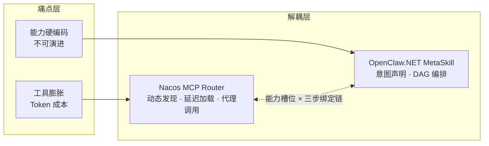
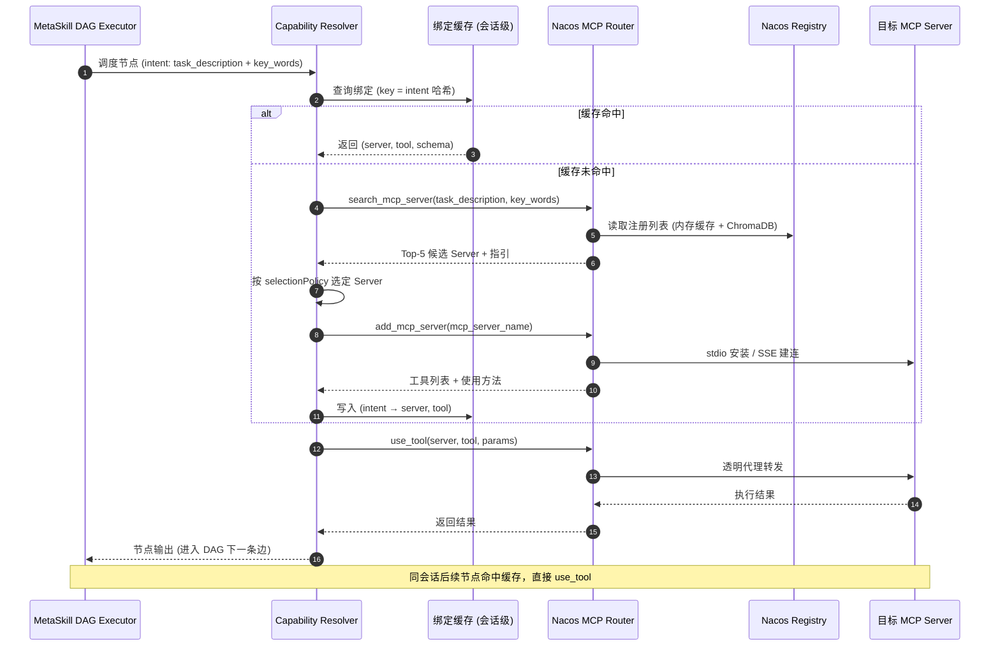

# Nacos MCP Router 与 OpenClaw.NET MetaSkill 集成架构设计

> 版本：v1.0　　日期：2026-09-13
>
> 适用环境：Nacos 3.2.4（MCP Registry）· Nacos MCP Router（router 模式）· OpenClaw.NET Runtime

---

## 1. 概述

本文档描述如何将 **Nacos MCP Router** 的动态能力发现机制与 **OpenClaw.NET 的 MetaSkill 技能编排体系**结合，构建一个「注册—发现—绑定—编排」四层解耦的 Agent 能力架构。

核心命题：

- **Nacos MCP Router** 解决「能力发现与延迟加载」：Agent 只暴露 `search_mcp_server`、`add_mcp_server`、`use_tool` 三个工具，通过关键字 + 语义向量检索按需挂载后端 MCP Server，避免一次性向模型暴露全部工具描述，显著降低 Token 消耗。
- **OpenClaw.NET MetaSkill** 解决「能力编排」：将领域工作流投影为技能 DAG，节点代表能力需求，边代表数据依赖。

两者的结合点：**把 MetaSkill 节点声明为「能力槽位（Capability Slot）」，把 Router 的三步工具链作为槽位的运行时绑定机制**。MetaSkill 声明「我需要什么能力」，Router 回答「注册中心里当前谁能提供」。

## 2. 背景与问题

### 2.1 要解决的痛点

| 痛点 | 表现 |
|---|---|
| 工具膨胀 | 后端 MCP Server 数量增长后，全部工具 Schema 注入上下文导致 Token 成本失控、模型选择困难 |
| 能力硬编码 | 工作流中直接写死具体服务/工具，服务升级或替换时需要改动编排逻辑，能力体系不可演进 |
| 治理缺失 | 私有/本地工具缺乏统一的注册、版本与准入管理 |
| 重复解析 | 每次会话由模型即兴完成「搜索—安装—调用」链，三轮 LLM 往返，成本高且行为不可复现 |

### 2.2 两者的职责互补



## 3. 核心概念映射

| Nacos / Router 侧 | OpenClaw.NET / MetaSkill 侧 | 映射关系 |
|---|---|---|
| MCP Server 注册信息（名称、版本、描述） | MetaSkill 节点的 capabilityRef 约束 | 注册即能力的供给侧元数据 |
| `description` 字段 | intent 中的 task_description / key_words | 共用同一套领域本体词汇 |
| Nacos namespace / group | DDD 限界上下文 | 命名空间划分领域边界 |
| `search_mcp_server` | Capability Resolver 的检索阶段 | 槽位解析第一步 |
| `add_mcp_server` | 绑定建立 + 连接池初始化 | 槽位解析第二步 |
| `use_tool` | DAG 节点的实际执行 | 透明代理调用 |
| Nacos 配置变更事件 | 绑定缓存失效信号 | 治理平面驱动运行时刷新 |
| 导入允许列表（3.2.4 新增） | MetaSkill 包的依赖准入 | 管理员预先放行私有/本地工具 |

## 4. 总体架构

```mermaid
flowchart TB
    subgraph OC["OpenClaw.NET Runtime"]
        direction TB
        DAG["MetaSkill DAG Executor<br/>(编排平面)"]
        RES["Capability Resolver<br/>绑定缓存 · 选择策略 · 降级"]
        POOL["MCP 连接池<br/>(按 Server 名幂等复用)"]
        OBS["Trajectory / Audit 导出<br/>(可观测性闭环)"]
        DAG --> RES
        RES --> POOL
        DAG --> OBS
    end

    subgraph GW["Gateway MCP Client"]
        MCP["streamableHTTP<br/>http://router:8000/mcp"]
    end

    subgraph ROUTER["Nacos MCP Router (router 模式)"]
        direction TB
        T1["search_mcp_server<br/>关键字 + ChromaDB 语义检索 (Top-5)"]
        T2["add_mcp_server<br/>stdio 安装 / SSE 直连"]
        T3["use_tool<br/>透明代理转发"]
        T1 --> T2 --> T3
    end

    subgraph NACOS["Nacos 3.2.4 (MCP Registry — 注册与治理平面)"]
        direction TB
        REG["Server 注册 / 版本 / 描述"]
        NS["namespace · group<br/>(限界上下文划分)"]
        AL["导入允许列表<br/>(私有/本地地址准入)"]
        EVT["配置变更事件推送"]
    end

    subgraph BACKEND["后端 MCP Servers"]
        S1["weather-mcp"]
        S2["amap-mcp-server"]
        S3["... (动态扩展)"]
    end

    OC --> GW
    GW -->|"Agent 仅见 3 个工具"| ROUTER
    ROUTER --> REG
    NACOS -.->|变更事件 → 缓存失效| RES
    T3 --> BACKEND
```



架构平面划分：

- **注册与治理平面**（Nacos）：能力的供给侧元数据、版本、准入控制。
- **动态绑定平面**（Router）：检索、安装/连接、代理执行。
- **编排平面**（OpenClaw.NET MetaSkill）：以 DAG 声明能力需求与数据依赖，不感知具体服务。
- **运行时支撑**（Resolver / 连接池 / 缓存）：把三步链从 LLM 决策下沉为确定性代码路径。

## 5. 核心设计：能力槽位与绑定模式

### 5.1 能力槽位（Capability Slot）

MetaSkill 节点不直接引用工具，而是声明一个能力槽位。槽位支持两种绑定模式：

- **静态绑定**：节点直接写死 `mcp_server_name + tool_name`；槽位首次执行时自动 `add_mcp_server`，成功后记入运行时级幂等缓存（失败不缓存，下次调用重试），此后每次调用直接 `use_tool`。适用于核心链路、对稳定性要求高的节点。
- **动态绑定（延迟绑定）**：节点只携带 intent（`task_description` + `key_words`），槽位执行时才走 `search → add` 完成晚绑定、再 `use_tool` 执行；整条链路是确定性代码路径，零 LLM 往返。适用于长尾能力、跨系统能力——这正是 Router Top-5 语义检索的价值场景。

### 5.2 节点 Schema 示例（JSON-LD 投影）

能力需求以领域本体词汇表达，与 Nacos 注册描述共用同一套术语：

```json
{
  "@context": {
    "cap": "https://example.com/ontology/capability#",
    "ms": "https://agentqi.dev/metaskill#"
  },
  "@id": "ms:node/weather-query",
  "@type": "ms:SkillNode",
  "ms:capabilityRef": {
    "ms:binding": "dynamic",
    "ms:intent": {
      "@type": "cap:WeatherQuery",
      "ms:taskDescription": "查询指定城市的天气",
      "ms:keywords": "天气,城市"
    },
    "ms:selectionPolicy": "first",
    "ms:fallback": "ms:node/native-web-search"
  }
}
```

> 契约对齐（#230/#231 已实现）：`ms:keywords` 为**逗号分隔字符串**（SKILL.md 中写作数组，解析层拼接后对应 `resolve_capability` 的 `key_words` wire 参数），`ms:selectionPolicy` 为 `first` / `exact_name` 字符串枚举（对应 `selection_policy`）。`ms:fallback` 在解析层折叠为步骤的 `on_failure`，复用既有失败分支校验与路由。`topK` / `preferVersion` 仍是预留扩展，Resolver 支持前写入节点 schema 会以 `capabilityref_reserved_field` 拒绝。

领域对象（DDD）经 JSON-LD Framing 投影为 MetaSkill 节点时，`@type`（如 `cap:WeatherQuery`）同时作为语义检索的关键词来源，保证「本体词汇 → 检索查询 → 注册描述」三者处于同一向量空间。

### 5.3 capability_ref 字段映射与执行语义（#231 已实现）

SKILL.md 中的 `capability_ref` 与 JSON-LD 投影的字段对应，以及槽位执行器的运行时语义：

| SKILL.md 字段 | JSON-LD 术语 | 执行语义 |
|---|---|---|
| `binding: static` | `ms:binding = "static"` | 槽位首次执行自动 `add_mcp_server`；运行时级幂等缓存只记成功，失败下次重试；此后每次调用 `use_tool` |
| `binding: dynamic` | `ms:binding = "dynamic"` | 执行时经 #230 Resolver 核心 `search → add` 解析绑定，再 `use_tool`；零 LLM 往返；绑定按会话缓存（intent 哈希键，TTL/reload 失效，#232）；add 失败按 Top-5 顺序轮替候选，use_tool 失败按 retry 策略重试后走 fallback（#233） |
| `static.mcp_server_name` / `static.tool_name` | `ms:mcpServerName` / `ms:toolName` | 固定目标，直接决定 Router `add` / `use_tool` 的参数 |
| `intent.type` | `@type`（如 `cap:WeatherQuery`） | 本体类型标识，与注册描述共用同一向量空间词汇 |
| `intent.task_description` | `ms:taskDescription` | Router `search_mcp_server` 的 `task_description` wire 参数 |
| `intent.keywords` | `ms:keywords`（逗号分隔字符串） | Router `key_words` wire 参数；数组在解析层规范化拼接 |
| `selection_policy` | `ms:selectionPolicy` | `first`（缺省）/ `exact_name`，与 `resolve_capability` 同一枚举 |
| `fallback` | `ms:fallback`（节点引用） | 解析层折叠为步骤 `on_failure`，走既有失败分支校验与路由 |
| 步骤级 `tool_args` | —（运行时细节，不进本体） | 内层工具参数；执行器自动序列化为 Router `params` JSON 字符串 wire 字段 |

槽位执行失败一律以 `failure_code` 归一化返回，不抛异常：

| failure_code | 场景 |
|---|---|
| `capability_not_configured` | 运行时未注入槽位执行器 |
| `capability_router_unavailable` | Router 客户端缺失或不可达 |
| `capability_add_failed` | 静态 `add_mcp_server` 失败（明面 prose 或协议级） |
| `capability_use_tool_failed` | `use_tool` 失败（含 `failed to use tool:` prose 与协议级） |
| `capability_resolve_failed` | 动态解析失败（`no_candidates`、`selection_policy_no_match`、`all_adds_failed` 等，上游 `failure_code` 并入消息） |

另外：`use_tool` 返回的 Python repr 外壳（如 `[TextContent(type='text', text='...', ...)]`）在执行器内剥除后才进入模型上下文；`tool_args` 写作 YAML 映射即可，无需作者手工内嵌 JSON 字符串。

## 6. 执行时序

一次 DAG 节点执行的完整链路：



关键性质：

1. **解析幂等**：`add_mcp_server` 按 Server 名幂等，连接池复用，避免重复初始化。
2. **Token 最小化**：模型只接触 MetaSkill DAG 结构与 Router 的少量工具描述，而非全部后端服务的 Schema。
3. **绑定可演进**：更换/升级后端服务只需修改 Nacos 注册信息，MetaSkill 定义不变。

> 实现对照（2026-09-14，#230/#231/#232/#233/#238 已落地）：上图中动态槽位的 `search → add → use` 与静态槽位的 `add`（首次，幂等缓存）→ `use` 均为确定性代码路径；会话级绑定缓存（intent 哈希 + TTL/reload 失效）与节点级降级（fallback 路由 / Top-5 候选轮替 / retry 重试熔断）已实现；Nacos 变更事件订阅的失效联动（#238）已实现——变更到达即双清缓存（会话绑定缓存 + 运行时 added-server 缓存）并触发 watcher reload。

## 7. 关键工程决策

### 7.1 三步链下沉：从 LLM 决策到确定性代码

默认模式下，三步链由模型逐步推理完成，每次消耗三轮 LLM 往返且行为不可复现。建议在 OpenClaw.NET 中实现一个**原生工具**：

```
resolve_capability(intent) → binding { server, tool, schema }
```

内部程序化调用 Router 的三个端点，把绑定过程变成确定性代码路径；模型只负责产出 intent 参数。解析失败时再降级回 LLM 逐步模式。同时配合工具输出裁剪（如 TokenJuice 思路），对 search 返回的 Top-5 结果只保留 `name / description / rank`（rank 为候选在上游确定性排序中的位置；上游不返回 score，不做本地伪造）。

**已落地**（#230）：`resolve_capability` 原生工具实现上述路径，失败以 `failure_code` 归一化返回而非抛异常；LLM 逐步降级与会话级绑定缓存仍属后续项。

### 7.2 注册描述与本体对齐

Router 语义检索的质量完全取决于 Nacos 中 MCP Server 的 `description`。治理要求：

- 注册描述使用与 MetaSkill intent 同一套领域本体词汇（DDD 统一语言在基础设施层的投影）；
- 以 Nacos namespace / group 划分限界上下文（如 `namespace=logistics`、`namespace=geo`），Resolver 检索时按上下文过滤，缩小候选空间。

### 7.3 绑定缓存与失效

| 项 | 策略 |
|---|---|
| 缓存粒度 | 会话级（默认）+ 运行时级（静态绑定） |
| 缓存键 | intent 哈希（task_description + key_words + selectionPolicy） |
| 失效机制 | TTL 过期（可配，默认 300s）+ mcp.json reload 成功清空（#232 已实现）；订阅 Nacos 配置变更事件（#238 已实现，2026-09-14） |
| Nacos 变更事件订阅 | `RedNb.Nacos.All 2.0.0` LongPolling 订阅 mcp.json dataId；onChange → watcher reload → 会话绑定缓存 + 运行时 added-server 缓存双清；`ServerAddr` 未配置或 Nacos 不可达时优雅降级为 no-op，TTL/reload 兜底保持生效 |

### 7.4 版本与准入治理

- MetaSkill 包（SkillKit 产物）对依赖的 Server 声明 `name@version` 约束，与 Nacos 注册的服务版本字段对应；
- 私有/本地 MCP 工具导入须通过 Nacos 3.2.4 的导入允许列表，由管理员预先配置；MetaSkill 侧只允许引用已批准的 Server。

### 7.5 降级与容错（节点级）

| 失败点 | 策略 | 状态 |
|---|---|---|
| `search_mcp_server` 返回空 | 路由到 `ms:fallback` 指定节点（如 OpenClaw 原生 web 搜索工具） | #233 已实现 |
| `add_mcp_server` 失败 | 自动尝试 Top-5 中的下一个候选 | #233 已实现 |
| `use_tool` 执行错误 | 节点级重试 + 熔断，错误记入 DAG 执行轨迹 | #233 已实现 |

### 7.6 可观测性闭环

利用 OpenClaw.NET 的 trajectory / audit 导出能力，记录每次「intent → 选中 Server → 工具 → 结果」的完整链路。数据离线回流用于：

1. 作为 harness 回归测试的 fixture，保证绑定行为可复现；
2. 反哺优化：统计哪些 intent 经常选错 Server，据此修正 Nacos 注册描述与 MetaSkill 关键词（本体词汇对齐度度量）。

> 实现状态（#234 已实现，2026-09-14）：每次槽位执行的 binding 轨迹随 step executionEvidence（`meta-runs --json` 中位于 `stepResults[].executionEvidence.capabilityBinding`）持久化并可导出——含 binding 模式、intent（taskDescription/keyWords/selectionPolicy 与 intent 键）、缓存命中、选定 server/tool、绑定耗时、Top-N 候选与已尝试候选（name + rank）。上游不返回 score，轨迹只记 rank 不伪造 score（#230 契约）。导出 JSON 经 OpenClaw.Testing 的 `CapabilityBindingReplayFixture.FromMetaRun` / `CapabilityBindingReplay` 离线重放，断言同输入→同绑定（缓存命中变体通过播种缓存还原）。

## 8. 落地路径

| 阶段 | 做法 | 适用场景 |
|---|---|---|
| **Agent 级（PoC）** | Gateway 作为 MCP Client 直连 Router 的 streamableHTTP 端点，Agent 看到 3 个工具，三步链由模型完成；MetaSkill 先全部使用静态绑定 | 一周内跑通验证 |
| **Runtime 级（生产）** | 实现原生 Capability Resolver + 绑定缓存 + 变更事件订阅；MetaSkill 节点支持动态槽位；三步链确定性化 | 正式架构 |

> 实现状态（2026-09-14）：原生 Resolver（#230）与槽位执行（#231，静态 + 动态）已落地，三步链确定性化完成；会话级绑定缓存（#232）与节点级降级（#233）已实现；绑定轨迹可观测性与离线重放（#234）已实现；Nacos 变更事件订阅（#238）已实现。

## 9. 附录：最小配置示例

### 9.1 Nacos 注册 MCP Server（片段）

```json
{
  "mcpServers": {
    "weather-mcp": {
      "description": "天气服务：提供城市天气查询、天气预报等工具",
      "command": "npx",
      "args": ["-y", "@example/weather-mcp"],
      "env": { "WEATHER_API_KEY": "***" }
    }
  }
}
```

> 描述字段务必使用与领域本体一致的词汇，这是语义检索命中率的关键。

### 9.2 OpenClaw.NET 侧挂接 Router（streamableHTTP）

```json
{
  "mcpServers": {
    "nacos-mcp-router": {
      "url": "http://127.0.0.1:8000/mcp"
    }
  }
}
```

Router 启动环境变量：

```bash
export NACOS_ADDR=127.0.0.1:8848
export NACOS_USERNAME=nacos
export NACOS_PASSWORD=<password>
export TRANSPORT_TYPE=streamable_http
uvx --with "mcp<2" nacos-mcp-router@latest
```

> `--with "mcp<2"` 为必要约束（2026-09-14 live 验证）：Router 0.2.2 声明 `mcp>=1.9.4` 无上界，mcp 2.x 改名 `streamablehttp_client` 导入导致启动崩溃。

## 10. 总结

一句话概括本架构：

> **Nacos 是能力的注册与治理平面，Router 是能力的动态绑定平面，MetaSkill DAG 是能力的编排平面。**

三者通过「**intent 声明 + 延迟绑定 + 会话缓存**」缝合，同时解决了 Agent 系统的两个典型痛点：工具膨胀带来的 Token 成本，与能力静态硬编码带来的不可演进性。
