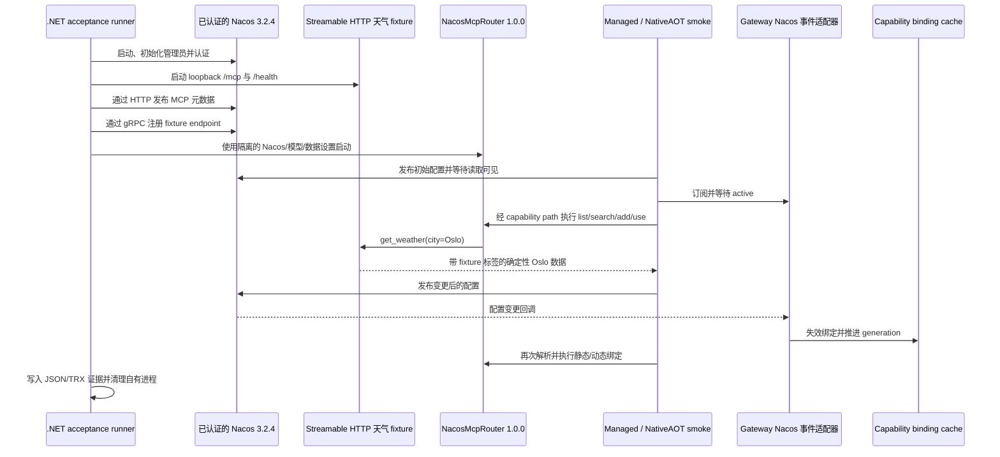

# Nacos Live 验收与 Gateway 集成架构

本文说明 .NET 10 live acceptance harness、managed/NativeAOT smoke 程序与 Gateway 可选 Nacos 适配器之间的关系。本文描述当前实现；Router 协议历史与能力解析语义分别见 [Nacos MCP Router 指南](../nacos-mcp-router.md) 和[能力解析文档](../capability-resolution.md)。

验收 harness 和天气 fixture 都是 .NET 应用。固定版本的 Router 是独立安装的 `NacosMcpRouter` 1.0.0 .NET global tool；这条验收链路不使用 Python。

## 组件边界

| 组件 | 负责 | 不负责 |
| --- | --- | --- |
| `eng/nacos-live` | 临时 Nacos、模型资产、天气 fixture、注册、Router 进程、验收证据和逆序清理 | Gateway 服务组合或生产环境 Nacos 生命周期 |
| `eng/NacosLiveSmoke` | 使用真实 Router 对 capability provider 与 Nacos 事件适配器进行 AOT/JIT smoke | 启动完整 Gateway host；smoke 直接组合相关适配器 |
| `OpenClaw.Gateway` | 按构建选项注册 Nacos capability provider 和事件源 | 供应商专属 capability 策略或导入 Nacos 配置 |
| `OpenClaw.Adapters.Nacos` | 调用 `search_mcp_server`、`add_mcp_server`、`use_tool` 并归一化 Router 错误 | Nacos SDK 事件订阅 |
| `OpenClaw.Adapters.Nacos.Events` | 后台配置监听器和通用 capability 失效 | 用远端配置内容替换 workspace MCP 配置 |
| `NacosMcpRouter` | Nacos MCP 搜索、安装和下游工具代理 | OpenClaw 授权、审批、hooks 与审计策略 |

Gateway 始终注册本地 capability provider。只有构建启用 `OPENCLAW_NACOS` 后，才会在 [`ToolServicesExtensions`](../../src/OpenClaw.Gateway/Composition/ToolServicesExtensions.cs) 中注册 Nacos provider。Nacos 配置事件是独立可选适配器，由 `OPENCLAW_NACOS_EVENTS` 控制。

## 构建与配置边界

| Gateway 构建方式 | Provider | Nacos 事件 SDK |
| --- | --- | --- |
| 默认 | `local` | 不引用 |
| `-p:OpenClawEnableNacos=true` | `local`、`nacos` | 不引用；支持 NativeAOT |
| 再加 `-p:OpenClawEnableNacosEvents=true` | `local`、`nacos` | 显式引用；支持 JIT 和 NativeAOT |

事件开关必须同时启用 `OpenClawEnableNacos`，否则 Gateway 项目会在构建时失败。不同 feature variant 使用独立的中间输出目录。Nacos 是可选依赖，默认 Gateway 依赖图不含 Nacos SDK。

运行时默认 provider 是 `local`；能力引用必须显式选择 `provider: nacos`。事件适配器从通用扩展配置 `adapterSettings.nacos` 读取设置，典型结构如下：

```json
{
  "adapterSettings": {
    "nacos": {
      "enabled": true,
      "serverAddr": "127.0.0.1:8848",
      "dataId": "openclaw-mcp.json",
      "group": "DEFAULT_GROUP",
      "longPollingTimeoutMs": 10000,
      "reconnectDelayMs": 5000
    }
  }
}
```

凭据通过部署配置中的 secret resolver 提供。配置缺失或禁用时不会创建 listener。监听器注册失败会以有上限的指数退避重试；`active` 表示监听注册已完成，不代表远端 Nacos 健康。匹配的配置变更会发布通用失效信号并推进 capability cache generation。listener 仅保留内容哈希以去重，不保存或应用配置内容。

## 端到端验收流程



`NacosLiveAcceptance` 下载官方 Nacos 3.2.4 archive，在解压前校验固定 SHA-256。它开启 Nacos authentication，将 server 绑定到 loopback，生成临时凭据、初始化管理员并完成登录。Nacos HTTP Console 端口固定为 `8080`：Router 1.0.0 的 Console API client 默认连接 `127.0.0.1:8080`，验收时没有可覆盖该地址的设置。Nacos 主端口与 gRPC 端口、Router HTTP 端口、fixture HTTP 端口均动态选择。运行前确保本机 `8080` 可用。

Runner 下载 Router 所需的四个 embedding 资产。默认来源为 ModelScope（`https://www.modelscope.cn`）、仓库 `sentence-transformers/all-MiniLM-L6-v2`、分支 `master`；其他 endpoint 默认分支 `main`。资产校验通过后才启动 Router。临时服务数据和生成的凭据留在本次运行专用临时目录；进程日志和报告写入指定 evidence 目录。结束时只停止本次拥有的进程并删除临时数据。

Fixture 仅监听 loopback，通过 `/mcp` 提供 Streamable HTTP，通过 `/health` 提供 readiness。它只暴露 `get_weather(city)`，只接受 Oslo，并返回标注为 `acceptance fixture` 的确定性数据（含 `temperature_c: 7.5`）。这不是实时天气观测。注册流程通过 Nacos HTTP API 发布 server/tool/endpoint 元数据，再通过 gRPC 注册实际 endpoint。

## Smoke 验收内容

Smoke 注册生产用的 `NacosEventRegistration`，等待 listener 状态变为 `active`，并通过 `McpServerToolRegistry` 连接真实 Router，要求 Router 恰好暴露三个工具。之后执行静态和动态 capability binding，各重复一次验证缓存命中；再发布一个新的 Nacos 配置 revision，检查 2,000 ms 内完成失效、cache 清空，并再次完成两种 binding。

每次天气结果都必须包含 Oslo 和数值类型的温度。Smoke 还断言 LLM 调用次数为零、JSON reflection 已关闭，以及进程模式与报告名称匹配（managed 的 `nativeAot: false`，NativeAOT 的 `nativeAot: true`）。Gateway 会在专用 workflow 中单独构建；smoke 是适配器级集成验证，不是完整 Gateway host 启动测试。

Runner 还会使用 `LiveRouter` filter 执行 `src/OpenClaw.Tests`。这些测试覆盖真实 Router 下的 `AgentRuntime` 与 `MafAgentRuntime`。常规测试无需 Nacos；现场测试由 `OPENCLAW_NACOS_LIVE` 显式启用。

## 运行与证据

前置条件：.NET SDK 10、Java 17 或更新版本、本机 NativeAOT 工具链、可访问 NuGet/Nacos/model 资产的网络，以及固定版本 Router global tool：

```powershell
dotnet tool install --global NacosMcpRouter --version 1.0.0
```

完整的主机专属 publish 和验收命令见 [`eng/nacos-live/README.md`](../../eng/nacos-live/README.md)。专用 [Nacos live workflow](../../.github/workflows/nacos-live.yml) 使用两个 Nacos build flags 构建 Gateway，同时构建 managed/NativeAOT smoke、运行 harness 单测并执行隔离验收。

成功必须看到 `NACOS_LIVE_ACCEPTANCE_PASS`，并生成以下证据：

| 产物 | 含义 |
| --- | --- |
| `managed.json`、`native.json` | Runtime 模式、reflection 设置、binding/cache 检查和失效延迟 |
| `acceptance.json` | Nacos/Router 版本、认证状态、fixture 标签、双 runtime 结果和整体状态 |
| `live-runtimes.trx` | 过滤后的现场 Router 测试结果 |
| `nacos.log`、`router.log`、`fixture.log` 与 smoke/test 日志 | 各进程的诊断信息 |

Gateway publish 成功或 NativeAOT 编译成功都不等于 acceptance 通过。分享日志前应检查其中是否包含凭据或环境数据。

## 保证范围与限制

验收证明已测试的 Nacos 3.2.4 / Router 1.0.0 contract、认证注册与配置订阅、managed/NativeAOT smoke 中的静态和动态 capability 执行、cache 失效与重新绑定，以及列出的 runtime 测试通过。它不证明任意注册表的搜索召回率、外部天气可用性、生产环境 uptime，也不代表任意 MCP server 都可安全调用。无论注册表元数据如何，Gateway 本地策略与授权始终有效。

供应商无关的 cache、授权、错误和 replay 语义见[能力解析文档](../capability-resolution.md)；Router wire contract 与历史 capture 见[Nacos MCP Router 指南](../nacos-mcp-router.md)。
