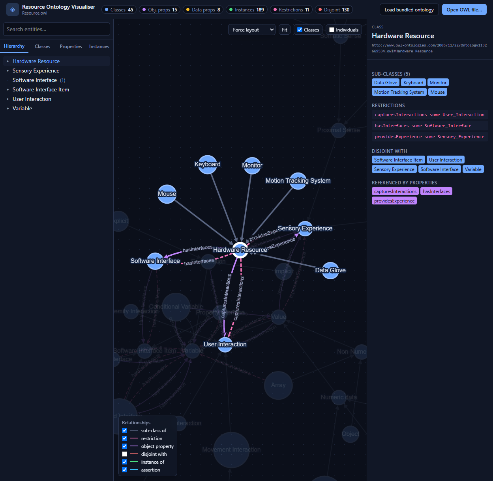

# Resource Ontology Visualiser

An interactive web application for exploring the **Resource Description Ontology** — an
OWL ontology developed for a University of Hull PhD on *“Describing Visualization
Resources: Enabling integration of diverse visualization resources”* (Richard Potter,
supervised by Dr. Helen Wright).

The app parses the ontology server-side with [dotNetRDF](https://dotnetrdf.org/) and
renders it as an explorable knowledge graph: a class hierarchy, a force-directed
relationship graph, and a details inspector with clickable cross-references.



---

## Table of contents

- [What is this ontology?](#what-is-this-ontology)
- [A quick OWL primer](#a-quick-owl-primer)
- [How OWL ontologies are visualised](#how-owl-ontologies-are-visualised)
- [What the visualiser shows](#what-the-visualiser-shows)
- [Architecture](#architecture)
- [Getting started](#getting-started)
- [Loading other ontologies](#loading-other-ontologies)
- [API reference](#api-reference)
- [Project structure](#project-structure)
- [The ontology file](#the-ontology-file)
- [Credits & citation](#credits--citation)

---

## What is this ontology?

`ontology/Resource.owl` is the research artefact at the centre of this project. It was
authored in [Protégé](https://protege.stanford.edu/) around 2005 (ontology IRI
`http://www.owl-ontologies.com/2005/11/22/Ontology1132669534.owl`).

**The research problem.** Scientific visualization increasingly happens in immersive,
virtual-reality environments controlled by *exotic* hardware — data gloves, motion
trackers, haptic devices, stereo displays. Traditionally a visualization has to be
hand-built around whatever hardware it targets (explicit coupling at design time). The
PhD proposed a layer of abstraction that **discovers and describes interaction resources
at runtime**, so a visualization can use a new device without being rewritten.

To make that possible you need a machine-readable way to describe *what a device can do*.
That is what this ontology provides. Its central idea is to describe a hardware device in
terms of:

- the **user interactions** it can capture (input — e.g. a gesture, a movement), and
- the **sensory experience** it provides to the user (output — e.g. visual, tactile),
- each exposed through one or more **software interfaces / interface items**,
- whose data is described by a **data set** of typed **variables**.

```
Hardware Resource ──hasInterfaces──▶ Software Interface ──hasInterfaceItems──▶ Interface Item
        │                                                                          │
        ├── capturesInteractions ──▶ User Interaction                  described using ▼
        └── providesExperience  ──▶ Sensory Experience  ◀── as a sensory   Data set / Variables
                                                              experience
```

The ontology is populated with a real, fully-described worked example: the **5DT Data
Glove 16**, including its sensors, the gestures it recognises, and its complete driver API
(`fdOpen`, `fdGetGesture`, `fdGetSensorScaled`, …) modelled as individuals. Alongside it
are biological senses (visual, tactile, proprioception …), data-type definitions, and
other devices (monitors, mice, keyboards, the Vicon tracking system).

> Most ontology metrics at a glance: **45 classes**, **15 object properties**,
> **8 datatype properties**, **189 named individuals**, **130 disjointness axioms** and
> several `someValuesFrom` restrictions.

---

## A quick OWL primer

[OWL (Web Ontology Language)](https://www.w3.org/OWL/) is a W3C standard for describing a
domain as a formal, machine-reasonable model. An OWL document is a set of **axioms** built
from three kinds of entity:

| Entity | What it is | Example here |
| --- | --- | --- |
| **Class** | A set/category of things | `Hardware_Resource`, `Data_Glove`, `Visual_Sense` |
| **Property** | A relationship or attribute | `hasInterfaces` (object), `hasVersion` (datatype) |
| **Individual** | A concrete instance | `_5DT_Data_Glove_Object`, `Flat_hand_gesture` |

Classes are arranged into a hierarchy with **`rdfs:subClassOf`** (`Data_Glove` is a
sub-class of `Hardware_Resource`). Beyond simple taxonomy, OWL can state rich logical
axioms, several of which appear in this ontology:

- **Object/Datatype properties** with a **domain** and **range** — e.g.
  `hasInterfaces` relates a `Hardware_Resource` (domain) to a `Software_Interface` (range).
- **Property characteristics** — e.g. *Functional* (`hasVersion` has at most one value).
- **Restrictions** — anonymous classes defining membership by relationship, such as
  `capturesInteractions some User_Interaction` (“a Hardware Resource captures at least one
  user interaction”).
- **Disjointness** — `owl:disjointWith` states two classes share no members
  (a `Monitor` is never a `Mouse`).

Ontologies are written in RDF and usually serialised as **RDF/XML** (the `.owl` file is
XML). Because the same model can be split across many statements, you don’t parse it like
ordinary XML — you read it into a graph of **triples** (subject → predicate → object) and
then lift the OWL axioms back out. This app uses dotNetRDF to do exactly that.

---

## How OWL ontologies are visualised

There is a well-established toolbox for looking at ontologies, and this project borrows the
best conventions from each:

- **Indented class trees** (as in Protégé’s class browser) are the clearest way to read the
  `subClassOf` taxonomy. → the **Hierarchy** tab in the sidebar.
- **Node-link graphs** (as in [WebVOWL](https://service.tib.eu/webvowl/),
  Protégé’s *OntoGraf*, and *OWLViz*) show the non-hierarchical structure — how classes
  relate through properties and restrictions — which a tree cannot. → the **central graph**.
- **Entity inspectors** list every axiom about a selected entity with hyperlinks to related
  entities. → the **details panel**.

A common visual grammar has emerged that this app follows:

| Glyph | Meaning |
| --- | --- |
| 🔵 Blue circle | **Class** (size scales with number of instances) |
| 🟢 Green rounded node | **Individual** (instance) |
| Grey arrow → | **sub-class of** (points to the parent) |
| Purple arrow → | **object property** (domain → range), labelled with the property |
| Pink dashed arrow ⇢ | **restriction** (e.g. `someValuesFrom`), labelled with the property |
| Red dashed line | **disjoint with** (no direction) |
| Green dotted arrow → | **instance of** (individual → class) |
| Blue arrow → | **property assertion** between two individuals |

Every relationship type can be toggled on/off from the legend in the bottom-left of the
graph, so you can isolate, say, just the disjointness network or just the property graph.

---

## What the visualiser shows

- **Class hierarchy tree** — collapsible `subClassOf` taxonomy with instance counts.
- **Interactive graph** — pan/zoom/drag, four layouts (force, hierarchy/tree, concentric,
  breadth-first), and per-relationship toggles.
- **Focus + neighbourhood highlight** — selecting an entity centres it and fades everything
  except its immediate connections.
- **Details inspector** — for a class: super-classes, sub-classes, restrictions, disjoint
  classes, referencing properties and instances; for a property: kind, characteristics,
  domain, range, inverse; for an individual: types and all property values. Every reference
  is a clickable link.
- **Search** across classes, properties and individuals.
- **Live stats** for the loaded document.
- **Open any OWL/RDF-XML file** via the button or drag-and-drop; the bundled ontology loads
  by default.

---

## Architecture

```
┌──────────────────────────┐        HTTP / JSON        ┌───────────────────────────┐
│  Svelte 5 + Vite SPA      │  ───────────────────────▶ │  ASP.NET Core (.NET 10)    │
│  Tailwind v4 + Cytoscape  │  ◀───────────────────────  │  Minimal API + dotNetRDF   │
│  (graph, tree, inspector) │     OntologyDto (JSON)     │  (RDF/XML → model)         │
└──────────────────────────┘                            └───────────────────────────┘
```

- **Backend** (`server/`) — an ASP.NET Core minimal API. `OntologyParser` loads the
  RDF/XML with dotNetRDF and lifts classes, properties, individuals, restrictions,
  disjointness and domain/range axioms into a clean JSON model
  (`OntologyDto`). In production it also serves the built SPA, so the whole app runs on a
  single port.
- **Frontend** (`client/`) — a Svelte 5 single-page app. [Cytoscape.js](https://js.cytoscape.org/)
  renders the graph (with `cytoscape-dagre` for the hierarchical layout); Tailwind v4
  handles styling.

The original `.owl` file is treated as read-only research data — it is only ever *read*.

---

## Getting started

### Prerequisites

- [.NET SDK 10](https://dotnet.microsoft.com/download) (the API targets `net10.0`)
- [Node.js 20+](https://nodejs.org/) (for building the Svelte client)

### Run it (single command)

```powershell
./run.ps1
```

This builds the Svelte client into `server/wwwroot`, starts the ASP.NET host on
<http://localhost:5174>, and opens your browser. The bundled ontology loads automatically.

Pass `-Rebuild` to force a fresh client build, or `-Port 8080` to change the port.

### Development mode (hot reload)

```powershell
./dev.ps1
```

Starts the API on `:5174` (via `dotnet watch`) **and** the Vite dev server on `:5173`
(with HMR). Vite proxies `/api` to the backend. Open <http://localhost:5173>.

### Manual steps

```bash
# 1. Build the front-end
cd client
npm install
npm run build        # emits to ../server/wwwroot

# 2. Run the back-end (serves API + SPA)
cd ../server
dotnet run --urls http://localhost:5174
```

---

## Loading other ontologies

The app can visualise any OWL ontology serialised as **RDF/XML**:

- Click **“Open OWL file…”** in the header, or
- **drag and drop** a `.owl` / `.rdf` / `.xml` file anywhere onto the window.

The file is parsed by the same server-side pipeline and never leaves your machine. Click
**“Load bundled ontology”** to return to `Resource.owl`.

---

## API reference

| Method | Route | Description |
| --- | --- | --- |
| `GET` | `/api/ontology/default` | Parsed model of the bundled `Resource.owl` (cached) |
| `GET` | `/api/ontology/source` | Raw RDF/XML source of the bundled ontology |
| `POST` | `/api/ontology/parse?name=<file>` | Parse an uploaded ontology (raw body or multipart) → model |
| `GET` | `/api/health` | Liveness check |

---

## Project structure

```
ResourceOntology/
├── ontology/
│   └── Resource.owl              # the PhD ontology (read-only research data)
├── server/                       # ASP.NET Core API + SPA host
│   ├── Models/OntologyDtos.cs    # JSON contract
│   ├── Services/OntologyParser.cs# RDF/XML → model (dotNetRDF)
│   ├── Program.cs                # endpoints, CORS, static SPA
│   └── wwwroot/                  # built SPA (generated; git-ignored)
├── client/                       # Svelte 5 + Vite + Tailwind + Cytoscape
│   └── src/
│       ├── App.svelte            # shell: header, panes, file loading
│       └── lib/                  # GraphView, Sidebar, DetailsPanel, parser glue, store
├── docs/screenshot.png
├── run.ps1                       # build client + run host (one command)
└── dev.ps1                       # API + Vite dev servers with hot reload
```

---

## The ontology file

`ontology/Resource.owl` is preserved exactly as authored — it has only been **moved** into
the `ontology/` folder for tidiness; its contents are unchanged. Treat it as the canonical
research artefact.

---

## Credits & citation

- **Ontology & research:** Richard Potter, University of Hull.
- **Supervisor:** Dr. Helen Wright, University of Hull.
- **Project:** *Describing Visualization Resources — Enabling integration of diverse
  visualization resources.*

Referenced in the original work:

- Felger, W., Schröder, F. (1992). *The Visualization Input Pipeline — Enabling Semantic
  Interaction in Scientific Visualization.* Eurographics 11(3).
- Chatzinikos, F., Wright, H. (2001). *Computational Steering by Direct Image
  Manipulation.* Vision, Modelling and Visualization (VMV01), Stuttgart.

Built with [dotNetRDF](https://dotnetrdf.org/), [Svelte](https://svelte.dev/),
[Cytoscape.js](https://js.cytoscape.org/) and [Tailwind CSS](https://tailwindcss.com/).
